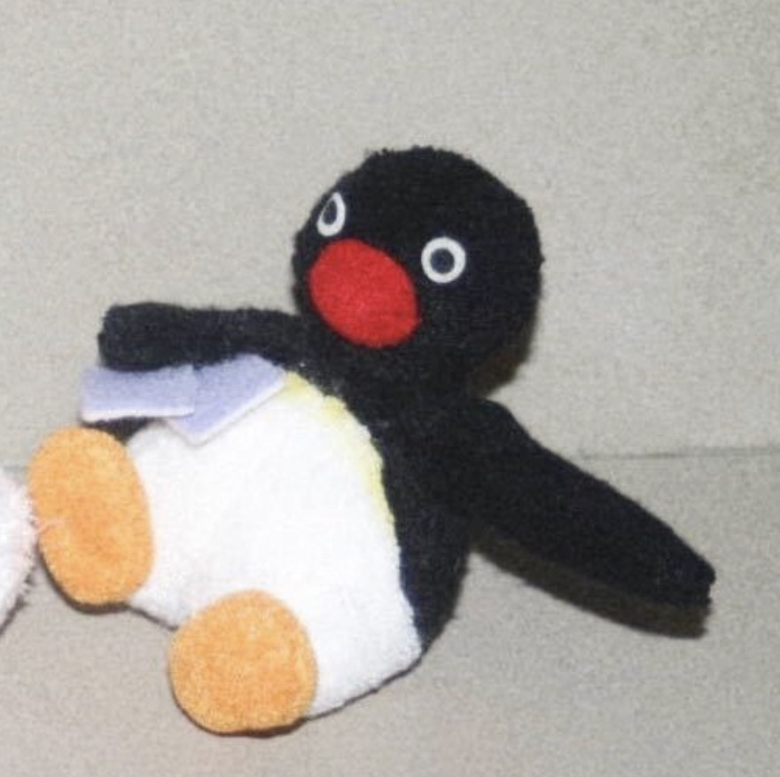

```{r setup, include = FALSE}
knitr::opts_chunk$set(
  echo = TRUE,
  message = FALSE,
  warning = FALSE)
```

<style type="text/css">

h1.title {
  text-align: center;
}

</style>

## Overview 

We're a group of graduate students at Columbia University Mailman School of Public Health. 

The mutual interest about travel and the shared experience of waiting for delayed flights in JFK united us together to do this project. 

Our technical skill sets of coding in R would thank to [P8105 Data Science I](https://p8105.com/index.html) taught by Prof. Jeff Goldsmith in fall 2022.

<br>

## Collaborators {.tabset}


### Fengyi Ma

```{r, echo = FALSE, out.width = "20%", fig.align = 'left'}

```

[Fengyi Ma](https://www.linkedin.com/in/fengyi-fiona-ma-945842255/)  
Second-Year MPH Candidate  
Major in Epidemiology  
Certificate in Applied Biostatistics and Public Health Data Science  
Email: [fm2751@cumc.columbia.edu](mailto:fm2751@cumc.columbia.edu)


### Jialu Cheng


```{r, echo = FALSE, out.width = "20%", fig.align = 'left'}

```

[Jialu Cheng](https://www.linkedin.com/in/jialu-cheng-b775b61a4/)  
Second-Year MPH Candidate    
Major in Epidemiology    
Certificate in Applied Biostatistics and Public Health Data Science  
Email: [jc5457@cumc.columbia.edu](mailto:jc5457@cumc.columbia.edu)


### Siyue Gao

```{r, echo = FALSE, out.width = "20%", fig.align = 'left'}

```

[Siyue Gao](https://siyuegao1205.github.io/siyuegao_website.github.io/)  
Second-Year MPH Candidate    
Major in Environmental Health Sciences    
Certificate in Applied Biostatistics and Public Health Data Science  
Email: [sg3889@cumc.columbia.edu](mailto:sg3889@cumc.columbia.edu)


### Yeque Sun

```{r, echo = FALSE, out.width = "20%", fig.align = 'left'}

```

[Yeque Sun](https://www.linkedin.com/in/yequesun/)  
Second-Year MPH Candidate    
Major in Environmental Health Sciences    
Certificate in Applied Biostatistics and Public Health Data Science  
Email: [ys3508@cumc.columbia.edu](mailto:ys3508@cumc.columbia.edu)


### Yingchen Xu

```{r, echo = FALSE, out.width = "20%", fig.align = 'left'}

```

[Yingchen Xu](https://yingchenx.github.io/)  
Second-Year MPH Candidate  
Major in Biostatistics  
Certificate in Advanced Epidemiology  
Email: [yx2711@cumc.columbia.edu](mailto:yx2711@cumc.columbia.edu)

