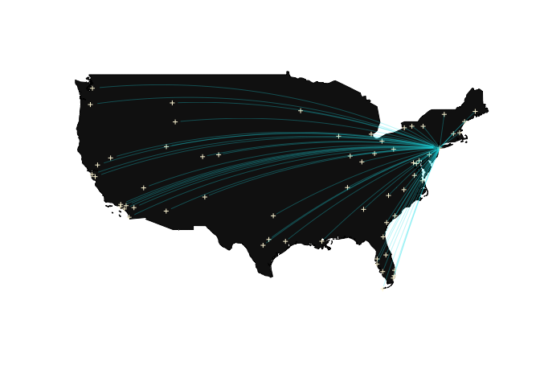

Flight Connection Map
================

## Data Import

``` r
airport = read_csv("tidied_data/airport.csv")

dest = airport %>% 
  filter(airport != "JFK") %>% 
  drop_na()
  
jfk = airport %>% 
  filter(airport == "JFK")
```

## Create Flight Connection Map

``` r
map("world",
    regions = c("usa"), 
    fill = TRUE, 
    col = "grey8",
    ylim = c(21.0, 50.0), 
    xlim = c(-130.0, -65.0)
    )

points(airport$long,
       airport$lat, 
       pch = 3,
       cex = 0.5,
       col = "cornsilk")

for (i in (1:dim(dest)[1])) { 
  
  inter = gcIntermediate(c(jfk$long[1], jfk$lat[1]), c(dest$long[i], dest$lat[i]))
  
  lines(inter, lwd = 0.3, alpha = 0.5, col = "turquoise2")
  
}
```

<!-- -->
