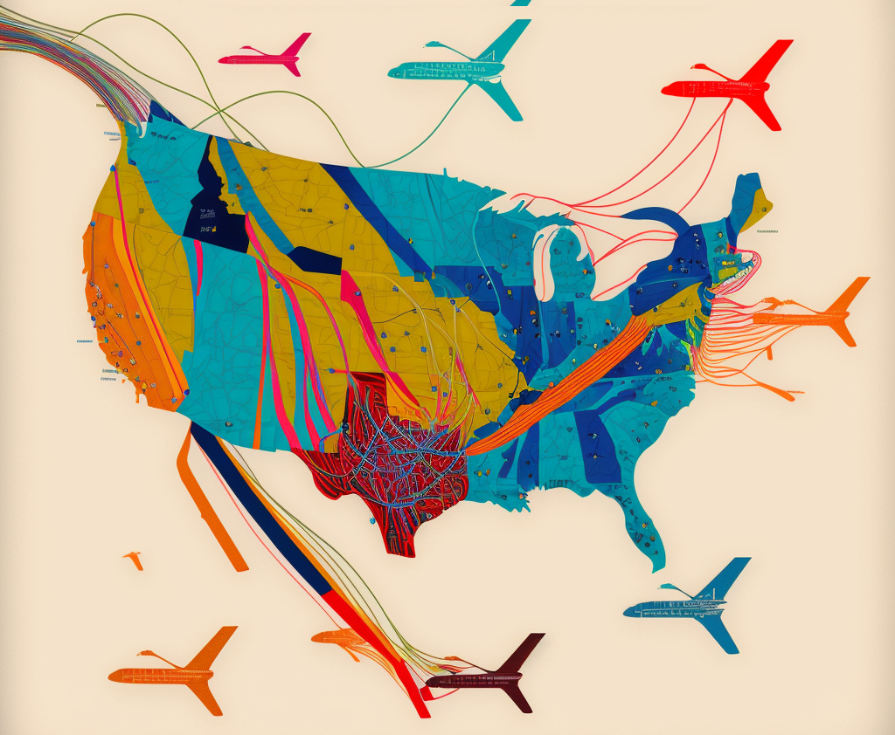

```{r setup, include=FALSE}
knitr::opts_chunk$set(
  echo = TRUE,
  message = FALSE,
  warning = FALSE)
```

&nbsp;

```{r, echo=FALSE, out.width="100%", fig.cap="(generated via [Midjourney](https://midjourney.com/))", fig.align = 'center'}

```

&nbsp;

## Website Overview

(Insert the video here)

&nbsp;

Where are you heading to during the holiday season? As the holiday season approaches, the demand for departure flights from NYC is booming. However, trip planning is always accompanied by the issue of potential flight delay, especially in busy metropolitan airports like JFK. Using JFK departed flights as an example, we’re interested in exploring the factors that are potentially related with flight delay (e.g., airlines, weather, and COVID conditions), in order to give the holiday travelers a better sense of what to expect regarding flight delay for this holiday season. 

Our analysis focuses on the flight delay data from the Bureau of Transportation Statistics (BTS), with the most popular airlines’ data in the manually selected time ranges of last holiday season (2021.11.1 - 2022.1.31). Meanwhile, the weather condition information was obtained from the National Oceanic and Atmospheric Administration (NOAA), and COVID information from NYC OpenData. 

&nbsp;

## Key Questions We Focused on

**1. What are the key trends of the flights in JFK during last holiday season?**

  *  Exploratory analysis including descriptive table or histogram showing criteria’s distribution by categories or by time, and interactive maps showing the analyzed flight routes departed from JFK
  
  
**2. What are the potential factors that contribute to the flight delay in JFK during last holiday season?**

  *  Heatmap to visualize the impact of each factor
  *  Stratified analyses of flight delay data to test the difference among categories for each factor
  
  
**3. Are there significant associations of multiple factors with JFK flight delays during last holiday season?**

  *  Regression analysis


**4. How to spend my time in JFK during the flight delay?**

  *  A guidance to spend your time in JFK to wait for the delayed flights (see book icon)
