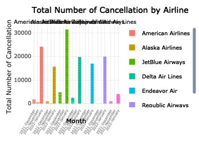
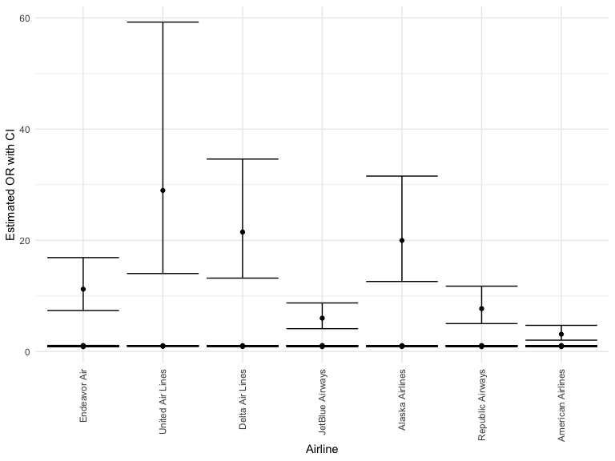
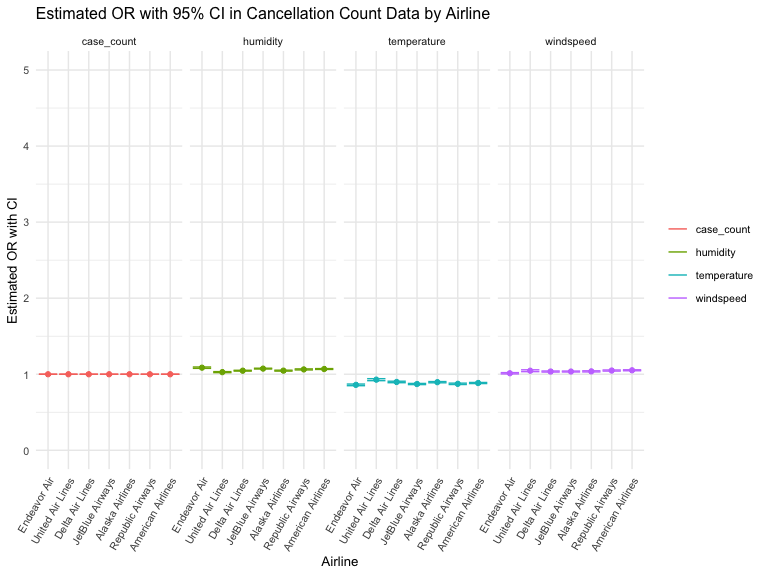

Poisson model
================

``` r
library(dplyr)
```

    ## 
    ## Attaching package: 'dplyr'

    ## The following objects are masked from 'package:stats':
    ## 
    ##     filter, lag

    ## The following objects are masked from 'package:base':
    ## 
    ##     intersect, setdiff, setequal, union

``` r
library(tidyverse)
```

    ## ── Attaching packages
    ## ───────────────────────────────────────
    ## tidyverse 1.3.2 ──

    ## ✔ ggplot2 3.3.6     ✔ purrr   0.3.4
    ## ✔ tibble  3.1.8     ✔ stringr 1.4.1
    ## ✔ tidyr   1.2.0     ✔ forcats 0.5.2
    ## ✔ readr   2.1.2     
    ## ── Conflicts ────────────────────────────────────────── tidyverse_conflicts() ──
    ## ✖ dplyr::filter() masks stats::filter()
    ## ✖ dplyr::lag()    masks stats::lag()

``` r
library(ggridges)
library(patchwork)
library(plotly)
```

    ## 
    ## Attaching package: 'plotly'
    ## 
    ## The following object is masked from 'package:ggplot2':
    ## 
    ##     last_plot
    ## 
    ## The following object is masked from 'package:stats':
    ## 
    ##     filter
    ## 
    ## The following object is masked from 'package:graphics':
    ## 
    ##     layout

``` r
knitr::opts_chunk$set(
    echo = TRUE,
    warning = FALSE,
    fig.width = 8, 
  fig.height = 6,
  out.width = "90%"
)

theme_set(theme_minimal() + theme(legend.position = "bottom"))


cancel_raw = read_csv("tidied_data/cancel.csv")
```

    ## Rows: 1441 Columns: 10
    ## ── Column specification ────────────────────────────────────────────────────────
    ## Delimiter: ","
    ## chr  (4): airline_name, flight_number, destination_airport, scheduled_hour
    ## dbl  (4): month, day, year, scheduled_elapsed_time_minutes
    ## date (1): date
    ## time (1): scheduled_departure_time
    ## 
    ## ℹ Use `spec()` to retrieve the full column specification for this data.
    ## ℹ Specify the column types or set `show_col_types = FALSE` to quiet this message.

``` r
covid = read_csv("tidied_data/covid.csv")
```

    ## Rows: 92 Columns: 5
    ## ── Column specification ────────────────────────────────────────────────────────
    ## Delimiter: ","
    ## dbl  (4): year, month, day, case_count
    ## date (1): date
    ## 
    ## ℹ Use `spec()` to retrieve the full column specification for this data.
    ## ℹ Specify the column types or set `show_col_types = FALSE` to quiet this message.

``` r
daily_weather = read_csv("tidied_data/daily_weather.csv")
```

    ## Rows: 92 Columns: 24
    ## ── Column specification ────────────────────────────────────────────────────────
    ## Delimiter: ","
    ## chr  (4): date, daily_precipitation, daily_snowfall, daily_weather
    ## dbl (20): year, month, day, daily_average_dew_point_temperature, daily_avera...
    ## 
    ## ℹ Use `spec()` to retrieve the full column specification for this data.
    ## ℹ Specify the column types or set `show_col_types = FALSE` to quiet this message.

# Outcome: mutate count cancellation data

Count numbers of cancellation by date

``` r
cancel <- cancel_raw %>% 
  mutate(number = 1)%>% 
  mutate(number = as.numeric(number)) %>% 
  group_by(date) %>% 
  mutate(cancel_count = sum(number)) %>% 
  select(-flight_number,-destination_airport,-scheduled_hour,-scheduled_departure_time,-scheduled_elapsed_time_minutes, -number) %>%
  distinct
```

# Merge outcome and predictors:

weather dataset: select `daily_average_dry_bulb_temperature`,
`daily_average_relative_humidity`, `daily_peak_wind_speed` predictors

``` r
weather <- daily_weather %>% 
  mutate(
    temperature = daily_average_dry_bulb_temperature,
    humidity = daily_average_relative_humidity,
    windspeed = daily_peak_wind_speed
         )  %>% 
  select(date, year, month, day, temperature, humidity, windspeed) 
```

merge dataset

``` r
# merge weather and covid dataset
weather_covid <- weather %>% left_join(covid, by = c("month", "day", "year"))
```

``` r
# merge cancel and weather_covid dataset
cancel_tidy <- weather_covid %>% 
  left_join(cancel, by = c("month", "day", "year")) 

cancel_tidy <- cancel_tidy%>% 
  mutate(
    temperature = as.numeric(temperature),
    humidity = as.numeric(humidity),
    windspeed = as.numeric(windspeed),
    case_count = as.numeric(case_count),
    airline_name = as_factor(airline_name),
    month = ifelse(month == 11, "November", 
                        ifelse(month == 12, "December", "January")),
    month2 = ifelse(month == "November", "Nov", 
                        ifelse(month == "December", "Dec", "Jan")),
    year_month = paste(year, month2, sep="-")) %>% 
    filter(!is.na(cancel_count))  %>% 
    select(-month2)
```

# Poisson model

``` r
poisson = glm(cancel_count ~ temperature + humidity + windspeed + case_count,family = "poisson",data=cancel_tidy)

summary(poisson)
```

    ## 
    ## Call:
    ## glm(formula = cancel_count ~ temperature + humidity + windspeed + 
    ##     case_count, family = "poisson", data = cancel_tidy)
    ## 
    ## Deviance Residuals: 
    ##     Min       1Q   Median       3Q      Max  
    ## -10.834   -3.818   -1.062    1.687   12.682  
    ## 
    ## Coefficients:
    ##               Estimate Std. Error z value Pr(>|z|)    
    ## (Intercept)  2.257e+00  8.342e-02   27.06   <2e-16 ***
    ## temperature -1.240e-01  1.852e-03  -66.97   <2e-16 ***
    ## humidity     5.970e-02  1.080e-03   55.29   <2e-16 ***
    ## windspeed    3.868e-02  1.313e-03   29.46   <2e-16 ***
    ## case_count   1.017e-05  8.435e-07   12.06   <2e-16 ***
    ## ---
    ## Signif. codes:  0 '***' 0.001 '**' 0.01 '*' 0.05 '.' 0.1 ' ' 1
    ## 
    ## (Dispersion parameter for poisson family taken to be 1)
    ## 
    ##     Null deviance: 15063.0  on 215  degrees of freedom
    ## Residual deviance:  5171.4  on 211  degrees of freedom
    ## AIC: 6137.1
    ## 
    ## Number of Fisher Scoring iterations: 6

# Poisson model Nested by month

``` r
cancel_tidy %>% 
  nest(df = -month) %>%
  mutate(
    models = map(.x = df, ~ glm(cancel_count ~ temperature + humidity + windspeed + case_count,family = "poisson", data = .x)),
    results = map(models, broom::tidy)
  ) %>% 
  unnest(results) %>% 
  select(month, term, estimate) %>% 
  mutate(term = fct_inorder(term)) %>% 
  pivot_wider(
    names_from = term, 
    values_from = estimate) %>% 
  knitr::kable(digits = 3)
```

| month    | (Intercept) | temperature | humidity | windspeed | case_count |
|:---------|------------:|------------:|---------:|----------:|-----------:|
| November |       0.073 |       0.058 |   -0.042 |     0.029 |          0 |
| December |      -0.902 |       0.006 |    0.026 |     0.035 |          0 |
| January  |       2.407 |      -0.133 |    0.064 |     0.034 |          0 |

# Poisson model nested by airline

## Descriptive table and plot

``` r
cancel_airline <- cancel_tidy  %>%
  group_by(year_month, airline_name) %>%
  mutate(Total_number_of_cancellation = sum(cancel_count)) 

cancel_airline %>%
  select(year_month, airline_name, Total_number_of_cancellation) %>%
  distinct %>% 
  pivot_wider(
  names_from = airline_name, 
  values_from = Total_number_of_cancellation) %>%
  head() %>% knitr::kable(digits = 2)
```

| year_month | American Airlines | Alaska Airlines | JetBlue Airways | Delta Air Lines | Endeavor Air | Republic Airways | United Air Lines |
|:-----------|------------------:|----------------:|----------------:|----------------:|-------------:|-----------------:|-----------------:|
| 2021-Nov   |                42 |              23 |              11 |               8 |            3 |                8 |                1 |
| 2021-Dec   |               174 |             143 |             252 |             226 |           10 |                5 |              171 |
| 2022-Jan   |              1047 |             977 |            1121 |            1039 |         1058 |             1047 |              672 |

``` r
plot_cancel_airline <- cancel_airline %>%
  ggplot(aes(x = year_month, y = Total_number_of_cancellation, fill = airline_name)) +
  geom_bar(stat = "identity", show.legend = FALSE) +
  labs(
    title = "Total Number of Cancellation by Airline",
    x = "Year and Month",
    y = "Total Number of Cancellation"
  ) +
  theme(legend.position="right", legend.title = element_blank(),
        text = element_text(size = 10),
        axis.text.x = element_text(angle = 60, hjust = 1, size = 5)) +
  facet_grid(. ~ airline_name)

  
ggplotly(plot_cancel_airline)
```



## Nesting airline

``` r
poisson_by_airline = cancel_tidy %>%
  nest(data = -airline_name) %>% 
  mutate(
    models = map(data, ~glm(cancel_count ~ temperature + humidity + windspeed + case_count, family = "poisson", data = .x)),
    results = map(models, ~broom::tidy(.x, conf.int = T))) %>% 
  select(airline_name, results) %>% 
  unnest(results) %>% 
  mutate(
    OR = exp(estimate),
    CI_lower = exp(conf.low),
    CI_upper = exp(conf.high),
    p_val = rstatix::p_format(p.value, digits = 2)
  ) %>% 
  select(airline_name, term, OR, CI_lower,CI_upper, p_val) 

poisson_by_airline %>% 
  filter(term != "(Intercept)" & p_val < .05) %>% 
  knitr::kable(digits = 3, align = "llccc", col.names = c("Airline Name", "Terms", "Estimated adjusted OR", "CI lower bound", "CI upper bound", "P-value"))
```

| Airline Name      | Terms       | Estimated adjusted OR | CI lower bound | CI upper bound | P-value  |
|:------------------|:------------|:---------------------:|:--------------:|:--------------:|:---------|
| American Airlines | temperature |         0.885         |     0.877      |     0.892      | \<0.0001 |
| American Airlines | humidity    |         1.069         |     1.063      |     1.074      | \<0.0001 |
| American Airlines | windspeed   |         1.052         |     1.046      |     1.059      | \<0.0001 |
| American Airlines | case_count  |         1.000         |     1.000      |     1.000      | \<0.0001 |
| Alaska Airlines   | temperature |         0.896         |     0.888      |     0.904      | \<0.0001 |
| Alaska Airlines   | humidity    |         1.047         |     1.041      |     1.053      | \<0.0001 |
| Alaska Airlines   | windspeed   |         1.038         |     1.030      |     1.045      | \<0.0001 |
| Alaska Airlines   | case_count  |         1.000         |     1.000      |     1.000      | 0.011    |
| JetBlue Airways   | temperature |         0.871         |     0.864      |     0.879      | \<0.0001 |
| JetBlue Airways   | humidity    |         1.074         |     1.069      |     1.079      | \<0.0001 |
| JetBlue Airways   | windspeed   |         1.036         |     1.029      |     1.042      | \<0.0001 |
| JetBlue Airways   | case_count  |         1.000         |     1.000      |     1.000      | \<0.0001 |
| Delta Air Lines   | temperature |         0.898         |     0.889      |     0.908      | \<0.0001 |
| Delta Air Lines   | humidity    |         1.046         |     1.041      |     1.052      | \<0.0001 |
| Delta Air Lines   | windspeed   |         1.036         |     1.029      |     1.043      | \<0.0001 |
| Endeavor Air      | temperature |         0.860         |     0.849      |     0.871      | \<0.0001 |
| Endeavor Air      | humidity    |         1.086         |     1.077      |     1.095      | \<0.0001 |
| Endeavor Air      | windspeed   |         1.013         |     1.005      |     1.021      | 0.002    |
| Endeavor Air      | case_count  |         1.000         |     1.000      |     1.000      | \<0.0001 |
| Republic Airways  | temperature |         0.874         |     0.865      |     0.883      | \<0.0001 |
| Republic Airways  | humidity    |         1.063         |     1.057      |     1.070      | \<0.0001 |
| Republic Airways  | windspeed   |         1.049         |     1.041      |     1.056      | \<0.0001 |
| Republic Airways  | case_count  |         1.000         |     1.000      |     1.000      | \<0.0001 |
| United Air Lines  | temperature |         0.929         |     0.915      |     0.941      | \<0.0001 |
| United Air Lines  | humidity    |         1.028         |     1.021      |     1.034      | \<0.0001 |
| United Air Lines  | windspeed   |         1.046         |     1.034      |     1.058      | \<0.0001 |

## Plot

Create a plot showing the estimated ORs and CIs for each airline

``` r
poisson_by_airline %>% 
  mutate(airline_name = fct_reorder(airline_name, OR)) %>%
  ggplot(aes(x = airline_name, y = OR)) +
  geom_point() +
  geom_errorbar(aes(ymin = CI_lower, ymax = CI_upper)) +
  theme(axis.text.x = element_text(angle = 90, vjust = 0.5, hjust = 1)) +
  labs(x = "Airline", y = "Estimated OR with CI")
```



``` r
poisson_by_airline %>%
  filter(term != "(Intercept)") %>%
  ggplot(aes(x = airline_name, y = OR, color = term)) + 
  geom_point() +
  geom_errorbar(aes(ymin = CI_lower, ymax = CI_upper)) +
  geom_hline(yintercept = 1, linetype="dashed", 
                color = "darkred", size = 1, alpha = .7) +
  labs(
    title = "Estimated OR with 95% CI in Cancellation Count Data by Airline",
    x = "Airline",
    y = "Estimated OR with CI"
  ) +
  ylim(0, 5) +
  theme(legend.position="right", legend.title = element_blank(),
        text = element_text(size = 10),
        axis.text.x = element_text(angle = 60, hjust = 1, size = 8)) + 
  facet_grid(. ~ term)
```


