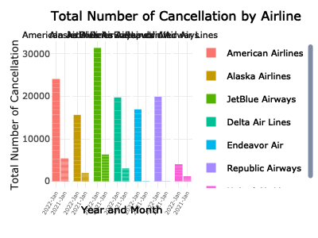

Poisson model
================

``` r
library(dplyr)
```

    ## 
    ## Attaching package: 'dplyr'

    ## The following objects are masked from 'package:stats':
    ## 
    ##     filter, lag

    ## The following objects are masked from 'package:base':
    ## 
    ##     intersect, setdiff, setequal, union

``` r
library(tidyverse)
```

    ## ── Attaching packages
    ## ───────────────────────────────────────
    ## tidyverse 1.3.2 ──

    ## ✔ ggplot2 3.3.6     ✔ purrr   0.3.4
    ## ✔ tibble  3.1.8     ✔ stringr 1.4.1
    ## ✔ tidyr   1.2.0     ✔ forcats 0.5.2
    ## ✔ readr   2.1.2     
    ## ── Conflicts ────────────────────────────────────────── tidyverse_conflicts() ──
    ## ✖ dplyr::filter() masks stats::filter()
    ## ✖ dplyr::lag()    masks stats::lag()

``` r
library(ggridges)
library(patchwork)
library(plotly)
```

    ## 
    ## Attaching package: 'plotly'
    ## 
    ## The following object is masked from 'package:ggplot2':
    ## 
    ##     last_plot
    ## 
    ## The following object is masked from 'package:stats':
    ## 
    ##     filter
    ## 
    ## The following object is masked from 'package:graphics':
    ## 
    ##     layout

``` r
knitr::opts_chunk$set(
    echo = TRUE,
    warning = FALSE,
    fig.width = 8, 
  fig.height = 6,
  out.width = "90%"
)

theme_set(theme_minimal() + theme(legend.position = "bottom"))


cancel_raw = read_csv("tidied_data/cancel.csv")
```

    ## Rows: 1441 Columns: 10
    ## ── Column specification ────────────────────────────────────────────────────────
    ## Delimiter: ","
    ## chr  (4): airline_name, flight_number, destination_airport, scheduled_hour
    ## dbl  (4): month, day, year, scheduled_elapsed_time_minutes
    ## date (1): date
    ## time (1): scheduled_departure_time
    ## 
    ## ℹ Use `spec()` to retrieve the full column specification for this data.
    ## ℹ Specify the column types or set `show_col_types = FALSE` to quiet this message.

``` r
covid = read_csv("tidied_data/covid.csv")
```

    ## Rows: 92 Columns: 5
    ## ── Column specification ────────────────────────────────────────────────────────
    ## Delimiter: ","
    ## dbl  (4): year, month, day, case_count
    ## date (1): date
    ## 
    ## ℹ Use `spec()` to retrieve the full column specification for this data.
    ## ℹ Specify the column types or set `show_col_types = FALSE` to quiet this message.

``` r
daily_weather = read_csv("tidied_data/daily_weather.csv")
```

    ## Rows: 92 Columns: 24
    ## ── Column specification ────────────────────────────────────────────────────────
    ## Delimiter: ","
    ## chr  (4): date, daily_precipitation, daily_snowfall, daily_weather
    ## dbl (20): year, month, day, daily_average_dew_point_temperature, daily_avera...
    ## 
    ## ℹ Use `spec()` to retrieve the full column specification for this data.
    ## ℹ Specify the column types or set `show_col_types = FALSE` to quiet this message.

# Preparations before modelling

## Outcome: mutate count cancellation data

Count numbers of cancellation per day

``` r
cancel <- cancel_raw %>% 
  mutate(number = 1)%>% 
  mutate(number = as.numeric(number)) %>% 
  group_by(date) %>% 
  mutate(cancel_count = sum(number)) %>% 
  select(-flight_number,-destination_airport,-scheduled_hour,-scheduled_departure_time,-scheduled_elapsed_time_minutes, -number) %>%
  distinct
```

## Merge outcome and predictors:

weather dataset: select `daily_average_dry_bulb_temperature`,
`daily_average_relative_humidity`, `daily_peak_wind_speed` predictors

``` r
weather <- daily_weather %>% 
  mutate(
    temperature = daily_average_dry_bulb_temperature,
    humidity = daily_average_relative_humidity,
    windspeed = daily_peak_wind_speed
         )  %>% 
  select(date, year, month, day, temperature, humidity, windspeed) 
```

merge dataset

``` r
# merge weather and covid dataset
weather_covid <- weather %>% left_join(covid, by = c("month", "day", "year")) %>% 
mutate(covid_case = case_count) %>% 
  select(-case_count)
```

## Final Tidied dataset

``` r
# merge cancel and weather_covid dataset
cancel_tidy <- weather_covid %>% 
  left_join(cancel, by = c("month", "day", "year")) 

cancel_tidy <- cancel_tidy%>% 
  mutate(
    temperature = as.numeric(temperature),
    humidity = as.numeric(humidity),
    windspeed = as.numeric(windspeed),
    covid_case = as.numeric(covid_case),
    airline_name = as_factor(airline_name),
    month = ifelse(month == 11, "November", 
                        ifelse(month == 12, "December", "January")),
    month2 = ifelse(month == "November", "Nov", 
                        ifelse(month == "December", "Dec", "Jan")),
    year_month = paste(year, month2, sep="-")) %>% 
    filter(!is.na(cancel_count))  %>% 
    select(-month2, -date.y, -date.x, -date)

write_csv(cancel_tidy, "tidied_data/cancel_tidy.csv")
```

# Check distribution

Since our outcome, `cancel_coun`t, is calculated using a count variable
(number of cancellation) repeated over time, we’ll model it using a
Poisson regression model.

``` r
# poisson distribution of counts
cancel_tidy %>% 
  ggplot(aes(x = cancel_count)) + 
  geom_histogram(binwidth = 1.8) +
  theme_light() +
  labs(x = "Numbers of cancellation per day",
       y = "Count",
       title = "Distribution of cancellation counts per day, 2021/11/1 to 2022/1/31") +
  theme(plot.title = element_text(hjust = 0.5))
```


## Stratification factors

Cancellation count per month show difference both by month and airline,
therefore, using month and airline as stratification factors

``` r
cancel_airline <- cancel_tidy  %>%
  group_by(year_month, airline_name) %>%
  mutate(Total_number_of_cancellation = sum(cancel_count)) 

cancel_airline %>%
  select(year_month, airline_name, Total_number_of_cancellation) %>%
  distinct %>% 
  pivot_wider(
  names_from = airline_name, 
  values_from = Total_number_of_cancellation) %>%
  head() %>% 
  knitr::kable(digits = 2, caption = "Total number of cancellation in each airline") 
```

| year_month | American Airlines | Alaska Airlines | JetBlue Airways | Delta Air Lines | Endeavor Air | Republic Airways | United Air Lines |
|:-----------|------------------:|----------------:|----------------:|----------------:|-------------:|-----------------:|-----------------:|
| 2021-Nov   |                42 |              23 |              11 |               8 |            3 |                8 |                1 |
| 2021-Dec   |               174 |             143 |             252 |             226 |           10 |                5 |              171 |
| 2022-Jan   |              1047 |             977 |            1121 |            1039 |         1058 |             1047 |              672 |

Total number of cancellation in each airline

``` r
write_csv(cancel_airline, "tidied_data/cancel_tidy.csv")
```

``` r
plot_cancel_airline <- cancel_airline %>%
  ggplot(aes(x = year_month, y = Total_number_of_cancellation, fill = airline_name)) +
  geom_bar(stat = "identity", show.legend = FALSE) +
  labs(
    title = "Total Number of Cancellation by Airline",
    x = "Year and Month",
    y = "Total Number of Cancellation"
  ) +
  theme(legend.position="right", legend.title = element_blank(),
        text = element_text(size = 10),
        axis.text.x = element_text(angle = 60, hjust = 1, size = 5)) +
  facet_grid(. ~ airline_name)

  
ggplotly(plot_cancel_airline)
```



# Poisson model

``` r
poisson = glm(cancel_count ~ temperature + humidity + windspeed + covid_case,family = "poisson",data=cancel_tidy)


summary(poisson) 
```

    ## 
    ## Call:
    ## glm(formula = cancel_count ~ temperature + humidity + windspeed + 
    ##     covid_case, family = "poisson", data = cancel_tidy)
    ## 
    ## Deviance Residuals: 
    ##     Min       1Q   Median       3Q      Max  
    ## -10.834   -3.818   -1.062    1.687   12.682  
    ## 
    ## Coefficients:
    ##               Estimate Std. Error z value Pr(>|z|)    
    ## (Intercept)  2.257e+00  8.342e-02   27.06   <2e-16 ***
    ## temperature -1.240e-01  1.852e-03  -66.97   <2e-16 ***
    ## humidity     5.970e-02  1.080e-03   55.29   <2e-16 ***
    ## windspeed    3.868e-02  1.313e-03   29.46   <2e-16 ***
    ## covid_case   1.017e-05  8.435e-07   12.06   <2e-16 ***
    ## ---
    ## Signif. codes:  0 '***' 0.001 '**' 0.01 '*' 0.05 '.' 0.1 ' ' 1
    ## 
    ## (Dispersion parameter for poisson family taken to be 1)
    ## 
    ##     Null deviance: 15063.0  on 215  degrees of freedom
    ## Residual deviance:  5171.4  on 211  degrees of freedom
    ## AIC: 6137.1
    ## 
    ## Number of Fisher Scoring iterations: 6

# Poisson model Nested by month

``` r
cancel_tidy %>% 
  nest(df = -month) %>%
  mutate(
    models = map(.x = df, ~ glm(cancel_count ~ temperature + humidity + windspeed + covid_case,family = "poisson", data = .x)),
    results = map(models, broom::tidy)
  ) %>% 
  unnest(results) %>% 
  select(month, term, estimate) %>% 
  mutate(term = fct_inorder(term)) %>% 
  pivot_wider(
    names_from = term, 
    values_from = estimate) %>% 
  knitr::kable(digits = 6, caption = "Poisson model nested by month")
```

| month    | (Intercept) | temperature |  humidity | windspeed | covid_case |
|:---------|------------:|------------:|----------:|----------:|-----------:|
| November |    0.073197 |    0.057638 | -0.041925 |  0.028955 |   -8.6e-05 |
| December |   -0.902469 |    0.006326 |  0.026320 |  0.035434 |    2.3e-05 |
| January  |    2.407321 |   -0.133471 |  0.064321 |  0.033555 |    9.0e-06 |

Poisson model nested by month

## OR and 95% CI

``` r
poisson_by_month = cancel_tidy %>%
  nest(data = -month) %>% 
  mutate(
    models = map(.x = data, ~glm(cancel_count ~ temperature + humidity + windspeed + covid_case, family = "poisson", data = .x)),
    results = map(models, broom::tidy)
    ) %>% 
  select(month, results) %>% 
  unnest(results) %>% 
  mutate(
    OR = exp(estimate),
    CI_lower = exp(estimate - 1.96 * std.error),
    CI_upper = exp(estimate + 1.96 * std.error),
    p.value = format(p.value, scientific = TRUE, digits = 3)
  ) %>% 
  select(month, term, OR, CI_lower,CI_upper, p.value) 

poisson_by_month %>% 
  filter(term != "(Intercept)" ) %>% 
  knitr::kable(digits = 3, align = "llccc", col.names = c("Month", "Terms", "Estimated adjusted OR", "CI lower bound", "CI upper bound", "P-value"))
```

| Month    | Terms       | Estimated adjusted OR | CI lower bound | CI upper bound | P-value   |
|:---------|:------------|:---------------------:|:--------------:|:--------------:|:----------|
| November | temperature |         1.059         |     1.020      |     1.100      | 2.52e-03  |
| November | humidity    |         0.959         |     0.936      |     0.983      | 7.29e-04  |
| November | windspeed   |         1.029         |     1.002      |     1.058      | 3.73e-02  |
| November | covid_case  |         1.000         |     0.999      |     1.001      | 7.77e-01  |
| December | temperature |         1.006         |     0.989      |     1.024      | 4.85e-01  |
| December | humidity    |         1.027         |     1.019      |     1.035      | 1.73e-11  |
| December | windspeed   |         1.036         |     1.022      |     1.050      | 1.42e-07  |
| December | covid_case  |         1.000         |     1.000      |     1.000      | 1.96e-29  |
| January  | temperature |         0.875         |     0.871      |     0.879      | 0.00e+00  |
| January  | humidity    |         1.066         |     1.064      |     1.069      | 0.00e+00  |
| January  | windspeed   |         1.034         |     1.031      |     1.037      | 5.43e-105 |
| January  | covid_case  |         1.000         |     1.000      |     1.000      | 2.55e-18  |

## Plot

Create a plot showing the estimated ORs and CIs for each month

``` r
poisson_by_month %>%
  filter(term != "(Intercept)") %>%
  ggplot(aes(x = month, y = OR, color = term)) + 
  geom_point(show.legend = FALSE, aes()) +
  geom_errorbar(aes(ymin = CI_lower, 
                    ymax = CI_upper)) +
  labs(
    title = "Estimated OR with 95% CI in Cancellation Count Data by Month",
    x = "Month",
    y = "Estimated OR with CI"
  ) +
  theme(legend.position="right", legend.title = element_blank(),
        text = element_text(size = 10),
        axis.text.x = element_text(angle = 60, hjust = 1, size = 8)) + 
  facet_grid(. ~ term)
```


# Poisson model nested by airline

``` r
cancel_tidy %>% 
  nest(df = -airline_name) %>%
  mutate(
    models = map(.x = df, ~ glm(cancel_count ~ temperature + humidity + windspeed + covid_case,family = "poisson", data = .x)),
    results = map(models, broom::tidy)
  ) %>% 
  unnest(results) %>% 
  select(airline_name, term, estimate) %>% 
  mutate(term = fct_inorder(term)) %>% 
  pivot_wider(
    names_from = term, 
    values_from = estimate) %>% 
  knitr::kable(digits = 6, caption = "Poisson model nested by airline")
```

| airline_name      | (Intercept) | temperature | humidity | windspeed | covid_case |
|:------------------|------------:|------------:|---------:|----------:|-----------:|
| American Airlines |    1.133334 |   -0.122565 | 0.066371 |  0.050882 |    1.6e-05 |
| Alaska Airlines   |    2.994560 |   -0.110218 | 0.046087 |  0.037056 |    6.0e-06 |
| JetBlue Airways   |    1.792243 |   -0.137557 | 0.071265 |  0.035052 |    1.3e-05 |
| Delta Air Lines   |    3.067498 |   -0.107131 | 0.045346 |  0.034974 |    2.0e-06 |
| Endeavor Air      |    2.417540 |   -0.150592 | 0.082641 |  0.012874 |    1.8e-05 |
| Republic Airways  |    2.042393 |   -0.134743 | 0.061405 |  0.047570 |    1.5e-05 |
| United Air Lines  |    3.366334 |   -0.073912 | 0.027191 |  0.045288 |   -4.0e-06 |

Poisson model nested by airline

## OR and 95% CI

``` r
poisson_by_airline = cancel_tidy %>%
  nest(data = -airline_name) %>% 
  mutate(
    models = map(.x = data, ~glm(cancel_count ~ temperature + humidity + windspeed + covid_case, family = "poisson", data = .x)),
    results = map(models, broom::tidy)
    ) %>% 
  select(airline_name, results) %>% 
  unnest(results) %>% 
  mutate(
    OR = exp(estimate),
    CI_lower = exp(estimate - 1.96 * std.error),
    CI_upper = exp(estimate + 1.96 * std.error),
    p.value = format(p.value, scientific = TRUE, digits = 3)
  ) %>% 
  select(airline_name, term, OR, CI_lower,CI_upper, p.value) 

poisson_by_airline %>% 
  filter(term != "(Intercept)" ) %>% 
  knitr::kable(digits = 3, align = "llccc", col.names = c("Airline Name", "Terms", "Estimated adjusted OR", "CI lower bound", "CI upper bound", "P-value"))
```

| Airline Name      | Terms       | Estimated adjusted OR | CI lower bound | CI upper bound | P-value   |
|:------------------|:------------|:---------------------:|:--------------:|:--------------:|:----------|
| American Airlines | temperature |         0.885         |     0.878      |     0.892      | 5.48e-196 |
| American Airlines | humidity    |         1.069         |     1.063      |     1.074      | 9.54e-138 |
| American Airlines | windspeed   |         1.052         |     1.046      |     1.059      | 9.69e-58  |
| American Airlines | covid_case  |         1.000         |     1.000      |     1.000      | 1.34e-13  |
| Alaska Airlines   | temperature |         0.896         |     0.888      |     0.904      | 2.16e-128 |
| Alaska Airlines   | humidity    |         1.047         |     1.041      |     1.053      | 5.48e-55  |
| Alaska Airlines   | windspeed   |         1.038         |     1.030      |     1.045      | 1.52e-24  |
| Alaska Airlines   | covid_case  |         1.000         |     1.000      |     1.000      | 1.07e-02  |
| JetBlue Airways   | temperature |         0.871         |     0.864      |     0.879      | 5.78e-209 |
| JetBlue Airways   | humidity    |         1.074         |     1.069      |     1.079      | 3.13e-183 |
| JetBlue Airways   | windspeed   |         1.036         |     1.029      |     1.042      | 1.87e-30  |
| JetBlue Airways   | covid_case  |         1.000         |     1.000      |     1.000      | 5.78e-10  |
| Delta Air Lines   | temperature |         0.898         |     0.889      |     0.908      | 1.21e-84  |
| Delta Air Lines   | humidity    |         1.046         |     1.041      |     1.052      | 9.07e-66  |
| Delta Air Lines   | windspeed   |         1.036         |     1.029      |     1.043      | 8.55e-24  |
| Delta Air Lines   | covid_case  |         1.000         |     1.000      |     1.000      | 3.60e-01  |
| Endeavor Air      | temperature |         0.860         |     0.850      |     0.871      | 3.84e-123 |
| Endeavor Air      | humidity    |         1.086         |     1.077      |     1.095      | 5.70e-87  |
| Endeavor Air      | windspeed   |         1.013         |     1.005      |     1.021      | 2.01e-03  |
| Endeavor Air      | covid_case  |         1.000         |     1.000      |     1.000      | 3.95e-12  |
| Republic Airways  | temperature |         0.874         |     0.865      |     0.883      | 1.07e-144 |
| Republic Airways  | humidity    |         1.063         |     1.057      |     1.070      | 4.68e-81  |
| Republic Airways  | windspeed   |         1.049         |     1.041      |     1.056      | 1.16e-40  |
| Republic Airways  | covid_case  |         1.000         |     1.000      |     1.000      | 4.10e-09  |
| United Air Lines  | temperature |         0.929         |     0.916      |     0.942      | 3.76e-25  |
| United Air Lines  | humidity    |         1.028         |     1.021      |     1.034      | 3.17e-16  |
| United Air Lines  | windspeed   |         1.046         |     1.034      |     1.059      | 1.73e-14  |
| United Air Lines  | covid_case  |         1.000         |     1.000      |     1.000      | 5.71e-02  |

## Plot

Create a plot showing the estimated ORs and CIs for each airline

``` r
poisson_by_airline %>%
  filter(term != "(Intercept)") %>%
  ggplot(aes(x = airline_name, y = OR, color = term)) + 
  geom_point(show.legend = FALSE, aes()) +
  geom_errorbar(aes(ymin = CI_lower, 
                    ymax = CI_upper)) +
  labs(
    title = "Estimated OR with 95% CI in Cancellation Count Data by Airline",
    x = "Airline",
    y = "Estimated OR with CI"
  ) +
  theme(legend.position="right", legend.title = element_blank(),
        text = element_text(size = 10),
        axis.text.x = element_text(angle = 60, hjust = 1, size = 8)) + 
  facet_grid(. ~ term)
```


