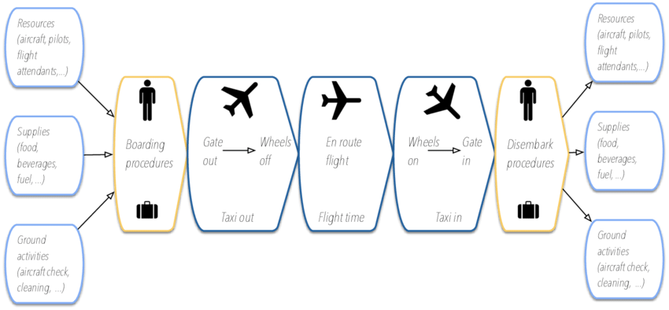

```{r setup, include = FALSE}
knitr::opts_chunk$set(
  echo = TRUE,
  message = FALSE,
  warning = FALSE)

library(tidyverse)
library(readxl)
library(plotly)

delay = read_csv("tidied_data/delay.csv")
cancel = read_csv("tidied_data/cancel.csv")
raw_df = read_csv("Reg_data_exp/raw_for_exp.csv")
```

<style type="text/css">

h1.title {
  text-align: center;
}

</style>

&nbsp;

## 1 Introduction 

### 1.1 Motivation

Most of us have experienced waiting at the airport for the delayed flight. As the holiday season approaches, departure on-time have becoming more and more challenging. This year, there are already [more than 4,000 flights delayed](https://www.npr.org/2022/11/27/1139327883/flights-delayed-canceled-holiday-travel-thanksgiving) as holiday travel spikes in the U.S. The flight delay issue especially concerns busy metropolitan airports like JFK.

```{r, echo = FALSE, out.width = "100%", fig.cap = "JFK Airport in 2022 holiday season: We can't stress this enough — plan ahead and arrive early", fig.align = 'center'}
knitr::include_graphics("./pictures/jfk.gif")
```

Source: [Twitter@JFKairport](https://twitter.com/JFKairport/status/1596760846075850752?s=20&t=izIa7AkbJaJ96p0IvvPFVw)

Using JFK departed flights as an example, we’re interested in exploring the factors that are potentially related with flight delay (e.g., airlines, weather, and COVID conditions). By doing so, we'd like to give the holiday travelers a better sense of what to expect regarding flight delay for this holiday season, in order to make better travel plans accordingly. 

&nbsp;

### 1.2 Related Work

#### Common Reasons for Flight Delays

Commercial aviation is a complex distributed transportation system. The typical operation of a commercial flight can take place at terminal boundaries, airports, runways, and airspace, being susceptible to different kinds of delays. Some examples include mechanical problems, weather conditions, ground delays, air traffic control, runway queues and capacity constraints.


```{r, echo = FALSE, out.width = "100%", fig.cap = "Common reasons for delay in the US, 2022", fig.align = 'center'}
knitr::include_graphics("./pictures/delay-reason.jpg")
```

Source: [transtats.bts.gov](https://www.transtats.bts.gov/OT_Delay/OT_DelayCause1.asp)

&nbsp;

#### Typical Operation of a Commercial Flight

The following scheme is repeated several times throughout the day for each flight in the system: 

```{r, echo = FALSE, out.width = "100%", fig.cap = "A typical operation of a commercial flight", fig.align = 'center'}

```

Source: [Sternberg, et al. (2017). A Review on Flight Delay Prediction.](https://www.researchgate.net/publication/315382748_A_Review_on_Flight_Delay_Prediction)

Pilots, flight attendants and aircrafts may have different schedules due to legal rests, duties, and maintenance plans for airplanes. So, any disruption in the system can impact the subsequent flights of the same airline. Moreover, disturbances may cause congestion at airspace or other airports, creating queues and delaying some flights from other carriers. 

&nbsp;

### 1.3 Initial Questions

As in the draft project proposal, we would like to do some reviews on the three airports serving New York City, i.e., JFK, LGA, and EWR. The initial questions we would like to focus on included the comparisons among these three airports, such as restaurants, shops and stores, lounges, and other facilities/services. 

However, considering the availability and scale of the accessible and available data, we switched our main topic to focus on JFK Airport's delay and cancellation data from 11/1/2021 to 1/31/2022. And the weather and COVID cases data within that time range were accordingly. Based on these information, our final questions are below:

* What were the key trends of the flights at JFK during last holiday season?
* What were the potential factors that might contribute to the flight delay/cancellation at JFK during last holiday season?
* Were there significant associations of multiple factors with JFK flight delays during last holiday season?

&nbsp;

## 2 Data Sources and Cleaning

We used three primary datasets for statistical analysis, and an additional supplemental dataset for interactive mapping.

### Delay and Cancellation

[Flight delay and cancellation data for JFK departures](https://www.transtats.bts.gov/ONTIME/) was obtained from the Bureau of Transportation Statistics (BTS). We first wrote a function to iterate on the reading-in process for each airline of interest from November 2021 to January 2022. Some new variable were created for subsequent analysis use, including scheduled hours for flight's departures, year, month, day, etc. Delay minutes were manually calculated as the time difference in actual departure time and scheduled departure time. Flights with actual elapsed time minutes equal to 0 were treated as cancellation. Air carriers were recoded as airline names to be more clear.

<br>

### Weather

[Hourly and daily weather information](https://www.ncdc.noaa.gov/cdo-web/datatools/lcd) from 11/1/2021 to 1/31/2022 was obtained from the National Oceanic and Atmospheric Administration (NOAA). We selected the specific zip code for JFK and downloaded the raw data thereof. To align the time unit of weather with flight information, considering data availability, we picked the weather at the 51th minute to represent the weather of the hour, and the weather at 23:59 to represent the weather condition of the day. Only date and hourly/daily weather condition of interest were kept in the resulted tidied dataset.

<br>

### COVID Cases

[Daily COVID cases count](https://data.cityofnewyork.us/Health/COVID-19-Daily-Counts-of-Cases-Hospitalizations-an/rc75-m7u3) from 11/1/2021 to 1/31/2022 was obtained, by API, from NYC OpenData, provided by the NYC Department of Health and Mental Hygiene (DOHMH). The resulted dataset included date, year, month, day, and daily case counts.

<br>

### Airport Location

An additional source for the interactive map was [U.S. domestic airport location information](https://data.humdata.org/dataset/ourairports-usa) from The Humanitarian Data Exchange, where we extracted the latitude and longitute for those airports with delay and/or cancellation records.

&nbsp;

### Summary of Variables of Interest

**Outcome**

  * *Delay Time*: Delay time in minutes
  * *Flgiht Cancellation Count*: Daily flight cancellation counts at JFK airport

<br>

**Potential Predictors**

Categorical Variables

  *   *Periods of Time*: Morning, Noon, Afternoon, Night
  *   *Months*: November, 2021; December, 2021; January, 2022
  *   *Airlines*: Alaska Airlines, American Airlines, Delta Air Lines, Endeavor Air, JetBlue Airways, Republic Airways, United Air Lines
  *   *Destination Airports*: 66 destination airports with records of delay/cancellation

Continuous Variables

  *   *Carrier Delay*: Carrier delay in minutes
  *   *Extreme Weather Delay*: Extreme weather delay in minutes
  *   *Late Arrival Delay*: Late arrival delay in minutes
  *   *NAS Delay*: National Aviation System (NAS) delay in minutes
  *   *Security Delay*: Security delay in minutes
  *   *Temperature*: Hourly dry bulb temperature (°F)
  *   *Humidity*: Hourly relative humidity (%)
  *   *Visibility*: Hourly visibility
  *   *Wind Speed*: Hourly wind speed (mph)
  *   *COVID Cases Count*: New daily cases of COVID; and, daily cases of COVID with 6 days' lag in time

&nbsp;

## 3 Explore

### 3.1 Desination Airport

There are 66 and 65 destination airports in the delay and cancellation datasets, respectively. For the efficiency purpose in statistical analysis, we do not include destination airport as a predictor in our models, but we still kept it as one of the predictor to explore.  
First, we checked if delay and cancellation counts differ in different destination airports. Flights from JFK to LAX have the highest delay occurrences with a number of 2293 and flights to BGR have the highest delay occurrences with a number of 6. Flights from JFK to SFO have the highest cancellation occurrences with a number of 76 and flights to BZN have the highest cancellation occurrences with a number of 1. We also took a look at whether different airlines could have different trends in delay and cancellation counts among all the destination airports, but there is no significant findings.  
We found that LAX and SFO have outstanding delay and cancellation counts, so we decided to take a closer look at the underlying factors behind those delays and cancellations. Some interesting findings are: 

*   The airlines which departure from JFK to the two airports are different. 
*   Both airports show an increasing trend in delay minutes from November to January. 
*   There is a distinct difference in cancellation counts in each scheduled hour between the two airports.


```{r, echo = F, out.height = "80%"}
delay_airline = delay %>% 
  filter(
    destination_airport %in% c("LAX", "SFO"),
    delay_minutes %in% 0:180
  ) %>% 
  mutate(
    text_label = airline_name
      ) %>% 
  plot_ly(x = ~destination_airport, y = ~delay_minutes, color = ~airline_name,
          text = ~text_label, hoverinfo = "text", type = 'box', alpha = .5) %>% 
    layout(
      boxmode = "group",
      xaxis = list(title = "Destination Airport", mirror = FALSE),
      yaxis = list(title = "Delay Time (minutes)"),
      legend = list(title = list(text = '<b> Airline </b>')))

delay_month = delay %>% 
  filter(
    destination_airport %in% c("LAX", "SFO"),
    delay_minutes %in% 0:180
  ) %>% 
  mutate(
    month = recode(month, "11" = "Nov", "12" = "Dec", "1" = "Jan"),
    month = as.factor(month),
    month = fct_reorder(month, date),
    text_label = str_c("Month: ", month)
  ) %>% 
  plot_ly(x = ~destination_airport, y = ~delay_minutes, color = ~month,
          text = ~text_label, hoverinfo = "text", type = 'box', alpha = .5) %>% 
    layout(
      boxmode = "group",
      xaxis = list(title = "Destination Airport", mirror = FALSE),
      yaxis = list(title = "Delay Time (minutes)"),
      legend = FALSE,
      offsetgroup = "A")

cancel_hour = delay %>% 
  filter(
    destination_airport %in% c("LAX", "SFO")
  ) %>% 
  group_by(scheduled_hour, destination_airport) %>% 
  summarize(
    count = n()
  ) %>% 
  mutate(
    text_label = str_c("Airport: ", destination_airport, "\nCount: ", count)
      ) %>% 
  plot_ly(x = ~scheduled_hour, y = ~count, color = ~destination_airport, text = ~text_label,
          hoverinfo = "text", type = 'bar', alpha = .5) %>% 
    layout(
      xaxis = list(title = "Scheduled Hour"),
      yaxis = list(title = "Count"),
      annotations = list(x = 0.5 , y = 1.2, text = "Cancellation by Scheduled Hour", showarrow = FALSE, font = list(size = 16), xref = "paper", yref = "paper"),
      margin = list(l = 50, r = 50, b = 50, t = 50))

Delay = subplot(delay_airline, delay_month) %>% 
  layout(
    annotations = list(
          list(x = 0.1, y = 1.2, text = "Delay by Airline", font = list(size = 16), showarrow = F, xref = "paper", yref = "paper"),
          list(x = 0.92, y = 1.2, text = "Delay by Month", font = list(size = 16), showarrow = F, xref = "paper", yref = "paper")
        ),
    showlegend = FALSE, margin = list(l = 50, r = 50, b = 70, t = 50)
      )

subplot(Delay, cancel_hour, nrows = 2, margin = 0.09) %>% 
  layout(showlegend = FALSE)
 
```


&nbsp;

### 3.2 Cancellation and Delay

We then created a **Shiny App** for the audience to engage in our data exploration process. The audience could select which airline and which month they concern and get the user-selected outputs. In the **Cancellation** tab, they could observe the number of cancellations and the number of COVID cases in each day of a month. In the **Delay** tab, they could observe the number of delays and the average delay time in minutes in each day of a month.


&nbsp;


### 3.3 Categorical Predictors

**Delay time** in minutes is one of our outcome of interests and we decided to conduct a **linear regression model**. Besides the main effects, we would like to check if there are any significant effect modifiers in our model. In this part, we investigated the interaction between the categorical predictors, including Periods of Time， Months，and Airlines.  
We could clearly observe that between groups differences are existed, and adding interaction terms between the categorical predictors could be one of the options for building the linear regression model. The following plots could hint that interactions between the categorical variables might exist, but we still need statistical analysis to prove our findings.


```{r}
raw_df %>% 
  mutate(
    month = fct_reorder(month, date)) %>% 
  plot_ly(x = ~hour_c, y = ~delay, color = ~airline,
          type = "box", mode = "markers", alpha = .5) %>% 
    layout(
      boxmode = "group",
      xaxis = list(title = "Period of Time"),
      yaxis = list(title = "Delay Time (minutes)", range = c(0, 180)),
      title = "Period and Airline Interaction")

raw_df %>% 
  mutate(
    month = fct_reorder(month, date)) %>% 
  plot_ly(x = ~month, y = ~delay, color = ~airline,
          type = "box", mode = "markers", alpha = .5) %>% 
    layout(
      boxmode = "group",
      xaxis = list(title = "Month"),
      yaxis = list(title = "Delay Time (minutes)", range = c(0, 180)),
      title = "Month and Airline Interaction")

raw_df %>% 
  mutate(
    month = fct_reorder(month, date)) %>% 
  plot_ly(x = ~hour_c, y = ~delay, color = ~month,
          type = "box", mode = "markers", alpha = .5) %>% 
    layout(
      boxmode = "group",
      xaxis = list(title = "Period of Time"),
      yaxis = list(title = "Delay Time (minutes)", range = c(0, 180)),
      title = "Hour and Month Interaction")

```


&nbsp;

### 3.4 Continuous Predictors

We were also interested in whether our continuous predictors, including Carrier Delay, Extreme Weather Delay, Late Arrival Delay, NAS Delay, Security Delay, Temperature, Humidity, Visibility, Wind Speed, could have different effects on different levels of periods of time, months, or airlines. Based on the graphs, we found that there could be significant interactions between:

*    Carrier Delay * Airline

*    Temperature * Month


```{r}
raw_df %>% 
  mutate(
    text_label = str_c(airline, "\nCarrier Delay: ", carrierd, "\nDelay Time: ", delay)
  ) %>% 
  plot_ly(x = ~carrierd, y = ~delay, color = ~airline,
          text = ~text_label, hoverinfo = "text",
          type = "scatter", mode = "markers", alpha = .7) %>% 
  layout(
    xaxis = list(title = "Carrier Delay (minutes)", range = c(0, 400)),
    yaxis = list(title = "Delay Time (minutes)", range = c(0, 400)),
    title = "Carrier Delay vs Delay Time by Airline")

raw_df %>%
  mutate(
    text_label = str_c("Month: ", month, "\nTemperature: ", temperature, "\nDelay Time: ", delay),
    month = fct_reorder(month, date)
    ) %>% 
  plot_ly(x = ~temperature, y = ~delay, color = ~month,
          text = ~text_label, hoverinfo = "text",
          type = "scatter", mode = "markers", alpha = .5) %>% 
  layout(
    xaxis = list(title = "Carrier Delay (minutes)"),
    yaxis = list(title = "Delay Time (minutes)", range = c(0, 400)),
    title = "Temperature vs Delay Time by Month")
```


As a result, these interaction terms in addition to other predictors would be further analyzed using statistical testing. Some possible analysis we would consider could be models cross validation, ANOVA test, Type III analysis.

&nbsp;

## 4 Statistical Anslysis

### 4.1 Linear Regression

&nbsp;

### 4.2 Poisson Regression

#### Pre-analysis

We wanted to investigate factors that are related to - and may be used to predict daily flight cancellation count since the effects of weather and COVID-19 were our primary research interests, but we did not have any precise hypothesis. For instance, there can be daily flight cancellations because of COVID breakouts or lockdowns. Due to the distribution of outcome, we recommend adopting the Poisson regression model.

Along with predictors, we also include categorical and time-dependent stratification parameters in the model. We clearly discovered the difference between different months and different airlines based on the monthly flight cancellation count. Monthly flight cancellations were the highest in January 2022, followed by December and November 2021. Monthly cancellation rates fluctuate greatly amongst airlines as well. As a result, we used the month and the airline as stratification factors. We first used Poisson regression to predict the risk ratio for daily flight cancellations in order to test for these variations.

From data exploration, we also found that the time trend of daily flight cancellations and COVID-19 cases did not coincide with one other. The rises of COVID-19 cases frequently took some time to affect our daily lives, including flight cancellations. Thus, we created new variables regarding COVID cases count with time lag. We used the lag selection criteria and Akaike's information criterion (AIC) to select 6 days as the optimal time lag. Then, we constructed a new variable named `covid_lag6`, equivalent to the value of COVID-19 cases with a 6-day time lag.

#### Building the model

Our final Poisson model was:

```{r, echo = FALSE, out.width = "100%", fig.cap = "(Poisson Regression Model)", fig.align = 'center'}
knitr::include_graphics("./pictures/poisson_model.png")
```

To test the model in different months and airlines, we also conducted a stratification analysis. We graphed these risk ratios for the coefficients (i.e., the exponentiated coefficient; exp(B)) that show the difference in daily flight cancellations in JFK airport by month and by airline for the purpose of illustration for both month and airline. Along with the p-value, we also provided 95% confidence intervals, which were calculated as the exponentiated coefficient plus or minus 1.96 times the standard error (exp(B+1.96*se)).


## 5 Discussions

### 5.1 Findings

&nbsp;
### 5.2 Limitations

The daily cancellation flight dataset was extracted from the delay dataset, therefore we only evaluate one source of cancellation, flight cancellation due to delay. Furthermore, we hypothesized that just two factors, adverse weather and COVID-19 cases, affect daily flight cancellations. More elements that might influence real-life cancellation were not considered. As a result, we should note the constraint that this cancellation data does not include cancellations due to other factors, such as air traffic limitations. This restricted the information we could obtain from the cancellation dataset, preventing us from adjusting for variables we suspected were confounding the correlations.

What's more, the association between COVID-19 cases and daily flight cancellations was not as strong as we expected.  One reason might be that the research window was too short to discover the association because COVID-19 cases had a time lag and we only counted 3-month cancellations and COVID-19 cases.

### 5.3 Next Steps

&nbsp;
these interathese intera