Regression_delay
================
Fengyi Ma

# Step 1: Data Wrangling

## Data import

``` r
delay = read.csv("./tidied_data/delay.csv") %>% 
  janitor::clean_names() 

h_weather = read.csv("./tidied_data/hourly_weather.csv") %>% 
  janitor::clean_names() 
```

## Clean dataset ‘delay’

Check how many airlines

``` r
unique(delay$airline_name)
```

    ## [1] "Endeavor Air"      "American Airlines" "Alaska Airlines"  
    ## [4] "JetBlue Airways"   "Delta Air Lines"   "United Air Lines" 
    ## [7] "Republic Airways"

*7* -\> ok, keep

Check how many destinations

``` r
unique(delay$destination_airport)
```

    ##  [1] "MSP" "DTW" "RDU" "BTV" "BNA" "ROC" "IND" "RIC" "CLE" "SYR" "BUF" "CHS"
    ## [13] "PWM" "SAV" "CVG" "BGR" "PIT" "LAX" "SFO" "MIA" "ORD" "CLT" "SNA" "DCA"
    ## [25] "PHX" "SAT" "FLL" "DFW" "AUS" "SEA" "SAN" "PDX" "PBI" "ABQ" "SLC" "MCO"
    ## [37] "DEN" "BOS" "TPA" "SRQ" "SJU" "RSW" "ONT" "BUR" "MSY" "SJC" "ORH" "JAX"
    ## [49] "LAS" "BQN" "ATL" "PSP" "IAH" "EYW" "IAD" "STT" "SMF" "BWI" "ORF" "PHL"
    ## [61] "CMH" "RNO" "JAC" "EGE" "PSE" "BZN"

*66* -\> too many, remove

Keep variables of interest and `date` for merge purpose (which will be
removed later)

``` r
delay = delay %>% 
  mutate(
    airline = airline_name,
    hour = scheduled_hour,
    delay = delay_minutes,
    carrierd = delay_carrier_minutes,
    extrmwd = delay_weather_minutes,
    nasd = delay_national_aviation_system_minutes,
    securityd = delay_security_minutes,
    latarrd = delay_late_aircraft_arrival_minutes) %>% 
  mutate(hour = as.numeric(hour)) %>% 
  select(airline, date, month, hour, delay, carrierd, extrmwd, nasd, securityd, latarrd)
```

check ‘NA’

``` r
sum(is.na(delay))
```

*0* -\> good

## Clean dataset ‘h_weather’

About the measure of temperature: Since the dry bulb temperature is the
ambient air temperature measured by regular thermometers, that is, the
temperature often mentioned in our general weather forecast. Thus, we
decide to use the variable `hourly_dry_bulb_temperature` to represent
temperature.

``` r
h_weather = h_weather %>% 
  mutate(
    temperature = hourly_dry_bulb_temperature,
    humidity = hourly_relative_humidity,
    visibility = hourly_visibility,
    wind_s = hourly_wind_speed,
    hour = as.numeric(hour)) %>% 
      select(date, month, hour, temperature, humidity, visibility, wind_s)
```

check ‘NA’

``` r
sum(is.na(h_weather))
```

*0* -\> good

## Merge datasets ‘delay’ and ‘hourly_weather’

``` r
raw_df = merge(x = delay, y = h_weather, by = c("date", "month", "hour"),
               all.x = TRUE)
```

check ‘NA’

``` r
sum(is.na(raw_df))
```

*0* -\> good

To this step, we have our raw dataset for doing association analysis.
Since the outcome variable `delay` is a continuous variable, we would do
linear regression. However, there might be too many variables so far
(ignoring `date` we still got 12 potential predictors), so next step
will be fitting the model.

By intuition, I would set:

`airline` -\> categorical `month` -\> categorical `hour` -\> categorical
(need further categorization) and for the rest -\> continuous

## Inspections into the dataset

Let’s first check how each variable is roughly distributed.

### Dependent variable / outcome (continuous)

See if our dependent variable `delay` follows a normal distribution.

``` r
hist(raw_df$delay)
```

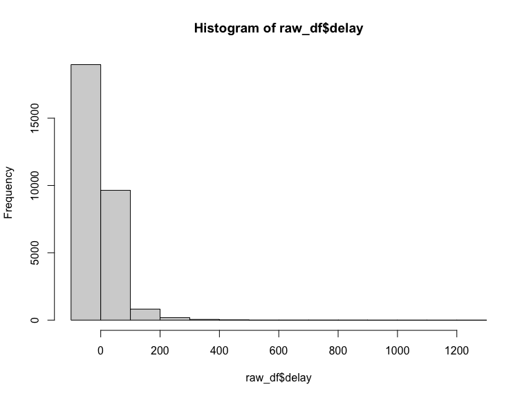

No, our dependent variable `delay` is not normally distributed.

-\> It is okay because for linear regression, dependent variable does
not have to be normally distributed. On the other hand, the model’s
residuals, do have to be normally distributed.

### Independent variables / predictors (categorical)

``` r
cat_sum = raw_df %>% 
  select(airline, month, hour) %>% 
  mutate(
    airline = as.factor(airline),
    month = as.factor(month),
    hour = as.factor(hour)
    ) %>% 
  summary(maxsum = 24)

cat_sum
```

    ##               airline      month      hour     
    ##  Alaska Airlines  :  888   1 : 9931   5 : 165  
    ##  American Airlines: 3976   11:10042   6 :1180  
    ##  Delta Air Lines  : 5513   12: 9752   7 :2035  
    ##  Endeavor Air     : 3711              8 :3311  
    ##  JetBlue Airways  :10199              9 :2065  
    ##  Republic Airways : 5094              10: 987  
    ##  United Air Lines :  344              11:1503  
    ##                                       12:1280  
    ##                                       13:1697  
    ##                                       14:1780  
    ##                                       15:2212  
    ##                                       16:1689  
    ##                                       17:1795  
    ##                                       18:1871  
    ##                                       19:2148  
    ##                                       20:1815  
    ##                                       21:1487  
    ##                                       22: 619  
    ##                                       23:  86

### Independent variables / predictors (continuous)

``` r
con_sum_df = raw_df %>% 
  select(-date, -airline, -month, -hour)

con_sum = skim(con_sum_df) %>%
  dplyr::select(-n_missing, -complete_rate) %>% 
  mutate(
    mean = numeric.mean,
    sd = numeric.sd,
    histogram = numeric.hist,
    var = skim_variable,
    min = numeric.p0,
    max = numeric.p100,
    median = numeric.p50,
    q1 = numeric.p25,
    q3 = numeric.p75
  ) %>% 
  dplyr::select(-numeric.mean, -numeric.sd, -numeric.hist, -skim_variable, -numeric.p0, -numeric.p100, -numeric.p50, -numeric.p25, -numeric.p75) %>% 
  relocate(var, mean, min, q1, median, q3, max, sd, histogram)

con_sum
```

    ## # A tibble: 10 × 10
    ##    var            mean   min    q1 median    q3   max    sd histogram skim_type
    ##    <chr>         <dbl> <dbl> <dbl>  <dbl> <dbl> <dbl> <dbl> <chr>     <chr>    
    ##  1 delay       11.7      -27    -5     -2     9  1252 45.8  ▇▁▁▁▁     numeric  
    ##  2 carrierd     7.31       0     0      0     0  1225 32.3  ▇▁▁▁▁     numeric  
    ##  3 extrmwd      0.614      0     0      0     0   850 12.2  ▇▁▁▁▁     numeric  
    ##  4 nasd         2.63       0     0      0     0   731 11.4  ▇▁▁▁▁     numeric  
    ##  5 securityd    0.0447     0     0      0     0   137  1.48 ▇▁▁▁▁     numeric  
    ##  6 latarrd      3.07       0     0      0     0   714 19.0  ▇▁▁▁▁     numeric  
    ##  7 temperature 41.4       10    35     42    49    68 10.8  ▁▃▇▆▂     numeric  
    ##  8 humidity    59.6       16    45     56    73   100 18.5  ▁▇▇▅▃     numeric  
    ##  9 visibility   9.42       0    10     10    10    10  1.95 ▁▁▁▁▇     numeric  
    ## 10 wind_s      11.9        0     7     11    16    32  6.22 ▅▇▇▃▁     numeric

Next, as mentioned above, we want to further categorize variable `hour`.

*Motivation:*

To increase the power of our model by reducing the number of parameters
involved and to be more efficient and concise.

*Rationale for the categorization of `hour`:*

Based on the previous inspection of variable `hour`, we could see that:
except for 5, 8, 10, 22, and 23, the frequencies of the other classes
are roughly even (between 1000-2000). Take this into consideration, our
rationale for classification will be a combination of convention and the
desire to achieve a uniform distribution.

Thus, we would categorize `hour` into the following 4 categories:

*morning*: 5-8

*noon*: 9-13

*afternoon*: 14-17

*night*:18-23

Now, we can start categorize `hour`

``` r
raw_df = raw_df %>% 
  mutate(hour_c = cut(hour, breaks = c(4, 8, 13, 17, 24),
                      labels = c("morning","noon","afternoon","night"))) %>% 
  select(-hour)
```

As usual, check if it was done properly

``` r
summary(as.factor(raw_df$hour_c))
```

    ##   morning      noon afternoon     night 
    ##      6691      7532      7476      8026

``` r
sum(is.na(raw_df))
```

    ## [1] 0

*0* ‘NA’ and the distribution looks good.

Now, since we are not yet able to decide the variable type of the rest
of the predictors, we need further analysis.

# Step 2: Check Assumptions for Regression

## Assumption 1: Linearity

Do simple linear regression for each independent variable, along with
scatterplots to assess the linearity

### Continuous vars

- temperature

``` r
lrTemp = lm(delay~temperature, data = raw_df)
summary(lrTemp) %>% broom::glance()
```

    ## # A tibble: 1 × 8
    ##   r.squared adj.r.squared sigma statistic  p.value    df df.residual  nobs
    ##       <dbl>         <dbl> <dbl>     <dbl>    <dbl> <dbl>       <int> <dbl>
    ## 1   0.00696       0.00693  45.7      208. 4.60e-47     1       29723 29725

``` r
summary(lrTemp) %>% 
  broom::tidy() %>% 
  select(term, estimate, p.value)
```

    ## # A tibble: 2 × 3
    ##   term        estimate   p.value
    ##   <chr>          <dbl>     <dbl>
    ## 1 (Intercept)   26.4   2.00e-137
    ## 2 temperature   -0.355 4.60e- 47

``` r
plot(delay~temperature, data = raw_df)
```

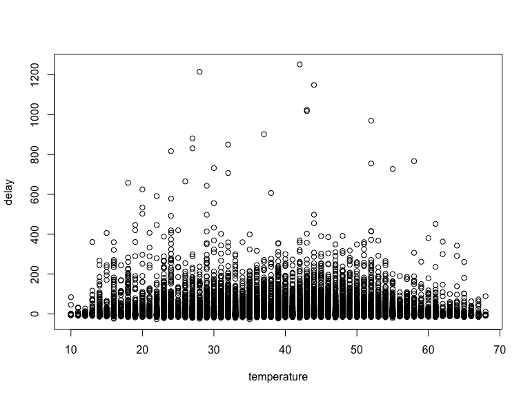

- humidity

``` r
lrHum = lm(delay~humidity, data = raw_df)
summary(lrHum) %>% broom::glance()
```

    ## # A tibble: 1 × 8
    ##   r.squared adj.r.squared sigma statistic  p.value    df df.residual  nobs
    ##       <dbl>         <dbl> <dbl>     <dbl>    <dbl> <dbl>       <int> <dbl>
    ## 1   0.00285       0.00282  45.8      85.0 3.16e-20     1       29723 29725

``` r
summary(lrHum) %>% 
  broom::tidy() %>% 
  select(term, estimate, p.value)
```

    ## # A tibble: 2 × 3
    ##   term        estimate  p.value
    ##   <chr>          <dbl>    <dbl>
    ## 1 (Intercept)    3.80  2.26e- 5
    ## 2 humidity       0.133 3.16e-20

``` r
plot(delay~humidity, data = raw_df)
```

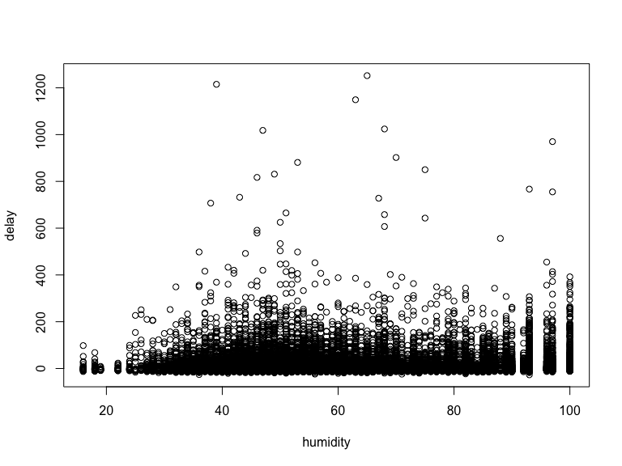

- visibility

``` r
lrVis = lm(delay~visibility, data = raw_df)
summary(lrVis) %>% broom::glance()
```

    ## # A tibble: 1 × 8
    ##   r.squared adj.r.squared sigma statistic  p.value    df df.residual  nobs
    ##       <dbl>         <dbl> <dbl>     <dbl>    <dbl> <dbl>       <int> <dbl>
    ## 1   0.00663       0.00660  45.7      198. 6.70e-45     1       29723 29725

``` r
summary(lrVis) %>% 
  broom::tidy() %>% 
  select(term, estimate, p.value)
```

    ## # A tibble: 2 × 3
    ##   term        estimate   p.value
    ##   <chr>          <dbl>     <dbl>
    ## 1 (Intercept)    29.7  1.45e-113
    ## 2 visibility     -1.91 6.70e- 45

``` r
plot(delay~visibility, data = raw_df)
```

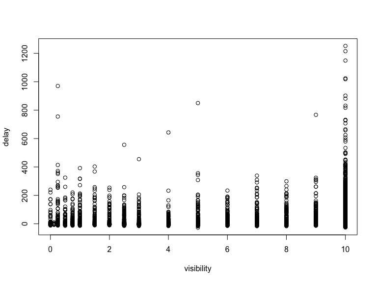

- wind speed

``` r
lrWin = lm(delay~wind_s, data = raw_df)
summary(lrWin) %>% broom::glance()
```

    ## # A tibble: 1 × 8
    ##   r.squared adj.r.squared sigma statistic  p.value    df df.residual  nobs
    ##       <dbl>         <dbl> <dbl>     <dbl>    <dbl> <dbl>       <int> <dbl>
    ## 1  0.000404      0.000370  45.8      12.0 0.000529     1       29723 29725

``` r
summary(lrWin) %>% 
  broom::tidy() %>% 
  select(term, estimate, p.value)
```

    ## # A tibble: 2 × 3
    ##   term        estimate  p.value
    ##   <chr>          <dbl>    <dbl>
    ## 1 (Intercept)    9.94  1.34e-66
    ## 2 wind_s         0.148 5.29e- 4

``` r
plot(delay~wind_s, data = raw_df)
```

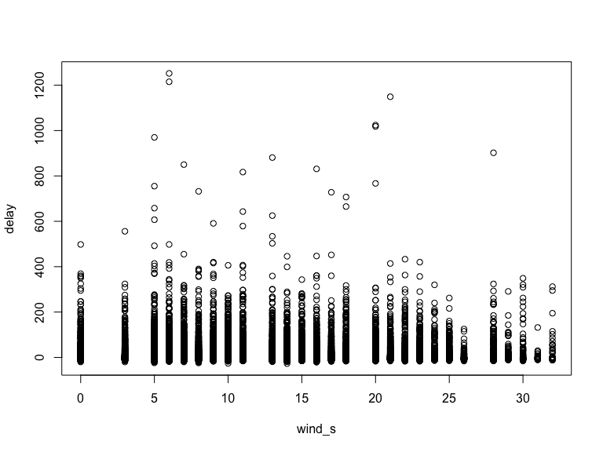

- carrier delay

``` r
lrCar = lm(delay~carrierd, data = raw_df)
summary(lrCar) %>% broom::glance()
```

    ## # A tibble: 1 × 8
    ##   r.squared adj.r.squared sigma statistic p.value    df df.residual  nobs
    ##       <dbl>         <dbl> <dbl>     <dbl>   <dbl> <dbl>       <int> <dbl>
    ## 1     0.654         0.654  27.0    56271.       0     1       29723 29725

``` r
summary(lrCar) %>% 
  broom::tidy() %>% 
  select(term, estimate, p.value)
```

    ## # A tibble: 2 × 3
    ##   term        estimate  p.value
    ##   <chr>          <dbl>    <dbl>
    ## 1 (Intercept)     3.31 3.30e-94
    ## 2 carrierd        1.15 0

``` r
plot(delay~carrierd, data = raw_df)
```

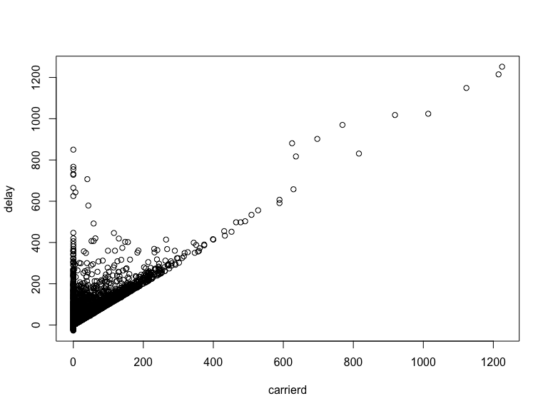

- extreme weather delay

``` r
lrExw = lm(delay~extrmwd, data = raw_df)
summary(lrExw) %>% broom::glance()
```

    ## # A tibble: 1 × 8
    ##   r.squared adj.r.squared sigma statistic p.value    df df.residual  nobs
    ##       <dbl>         <dbl> <dbl>     <dbl>   <dbl> <dbl>       <int> <dbl>
    ## 1    0.0805        0.0805  44.0     2603.       0     1       29723 29725

``` r
summary(lrExw) %>% 
  broom::tidy() %>% 
  select(term, estimate, p.value)
```

    ## # A tibble: 2 × 3
    ##   term        estimate p.value
    ##   <chr>          <dbl>   <dbl>
    ## 1 (Intercept)    11.1        0
    ## 2 extrmwd         1.07       0

``` r
plot(delay~extrmwd, data = raw_df)
```

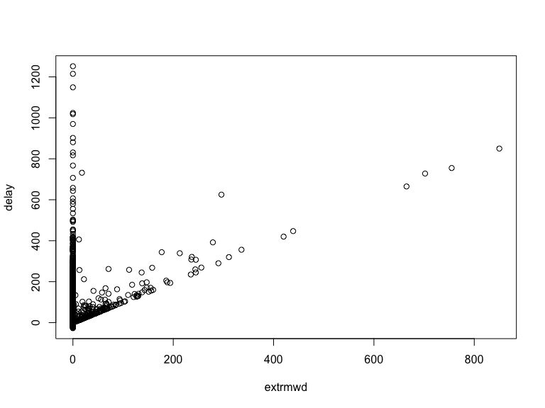

- NAS delay

``` r
lrNas = lm(delay~nasd, data = raw_df)
summary(lrNas) %>% broom::glance()
```

    ## # A tibble: 1 × 8
    ##   r.squared adj.r.squared sigma statistic   p.value    df df.residual  nobs
    ##       <dbl>         <dbl> <dbl>     <dbl>     <dbl> <dbl>       <int> <dbl>
    ## 1    0.0299        0.0299  45.2      917. 2.05e-198     1       29723 29725

``` r
summary(lrNas) %>% 
  broom::tidy() %>% 
  select(term, estimate, p.value)
```

    ## # A tibble: 2 × 3
    ##   term        estimate   p.value
    ##   <chr>          <dbl>     <dbl>
    ## 1 (Intercept)    9.89  6.55e-290
    ## 2 nasd           0.694 2.05e-198

``` r
plot(delay~nasd, data = raw_df)
```

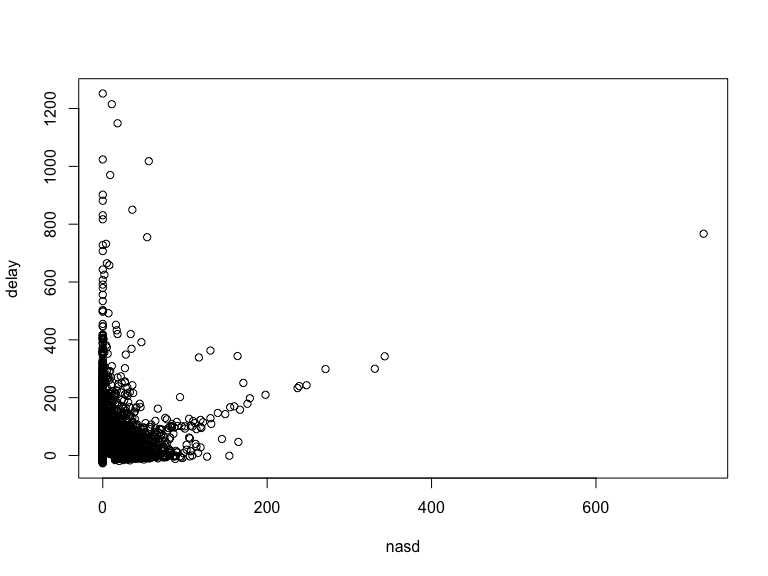

- security delay

``` r
lrSec = lm(delay~securityd, data = raw_df)
summary(lrSec) %>% broom::glance()
```

    ## # A tibble: 1 × 8
    ##   r.squared adj.r.squared sigma statistic  p.value    df df.residual  nobs
    ##       <dbl>         <dbl> <dbl>     <dbl>    <dbl> <dbl>       <int> <dbl>
    ## 1   0.00204       0.00200  45.8      60.7 6.92e-15     1       29723 29725

``` r
summary(lrSec) %>% 
  broom::tidy() %>% 
  select(term, estimate, p.value) 
```

    ## # A tibble: 2 × 3
    ##   term        estimate  p.value
    ##   <chr>          <dbl>    <dbl>
    ## 1 (Intercept)    11.6  0       
    ## 2 securityd       1.40 6.92e-15

``` r
plot(delay~securityd, data = raw_df)
```

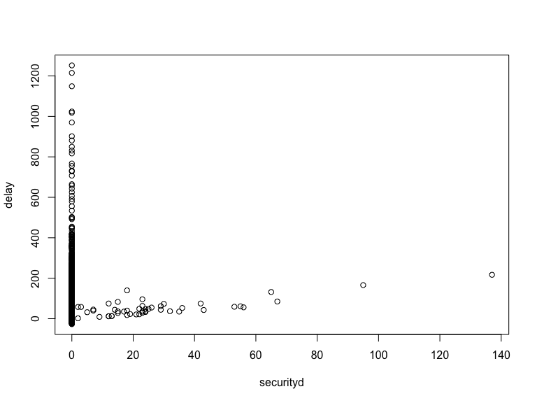

- late arrival delay

``` r
lrLat = lm(delay~latarrd, data = raw_df)
summary(lrLat) %>% broom::glance()
```

    ## # A tibble: 1 × 8
    ##   r.squared adj.r.squared sigma statistic p.value    df df.residual  nobs
    ##       <dbl>         <dbl> <dbl>     <dbl>   <dbl> <dbl>       <int> <dbl>
    ## 1     0.310         0.310  38.1    13339.       0     1       29723 29725

``` r
summary(lrLat) %>% 
  broom::tidy() %>% 
  select(term, estimate, p.value)
```

    ## # A tibble: 2 × 3
    ##   term        estimate   p.value
    ##   <chr>          <dbl>     <dbl>
    ## 1 (Intercept)     7.57 3.65e-246
    ## 2 latarrd         1.35 0

``` r
plot(delay~latarrd, data = raw_df)
```

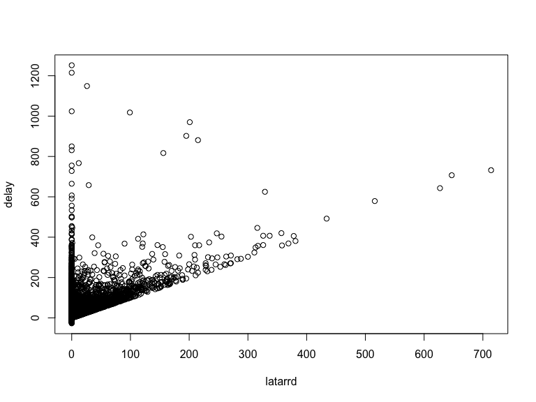

### Categorical vars

First, tell R that they are categorical variables

``` r
raw_df = 
  raw_df %>% 
  mutate(
    month = fct_infreq(as.factor(month)),
    hour_c = fct_infreq(hour_c),
    airline = fct_infreq(airline)
    )
```

- month

``` r
lrMon = lm(delay~month, data = raw_df)
summary(lrMon) %>% broom::glance()
```

    ## # A tibble: 1 × 8
    ##   r.squared adj.r.squared sigma statistic  p.value    df df.residual  nobs
    ##       <dbl>         <dbl> <dbl>     <dbl>    <dbl> <dbl>       <int> <dbl>
    ## 1   0.00939       0.00933  45.6      141. 1.23e-61     2       29722 29725

``` r
summary(lrMon) %>% 
  broom::tidy() %>% 
  select(term, estimate, p.value)
```

    ## # A tibble: 3 × 3
    ##   term        estimate  p.value
    ##   <chr>          <dbl>    <dbl>
    ## 1 (Intercept)     6.53 1.69e-46
    ## 2 month1         10.8  1.05e-62
    ## 3 month12         4.77 1.97e-13

- hour

``` r
lrHour = lm(delay~hour_c, data = raw_df)
summary(lrHour) %>% broom::glance()
```

    ## # A tibble: 1 × 8
    ##   r.squared adj.r.squared sigma statistic  p.value    df df.residual  nobs
    ##       <dbl>         <dbl> <dbl>     <dbl>    <dbl> <dbl>       <int> <dbl>
    ## 1   0.00934       0.00924  45.6      93.4 3.65e-60     3       29721 29725

``` r
summary(lrHour) %>% 
  broom::tidy() %>% 
  select(term, estimate, p.value)
```

    ## # A tibble: 4 × 3
    ##   term            estimate   p.value
    ##   <chr>              <dbl>     <dbl>
    ## 1 (Intercept)        18.2  7.34e-273
    ## 2 hour_cnoon         -8.54 2.39e- 31
    ## 3 hour_cafternoon    -6.21 2.62e- 17
    ## 4 hour_cmorning     -12.1  7.68e- 58

- airline

``` r
lrAL = lm(delay~airline, data = raw_df)
summary(lrAL) %>% broom::glance()
```

    ## # A tibble: 1 × 8
    ##   r.squared adj.r.squared sigma statistic   p.value    df df.residual  nobs
    ##       <dbl>         <dbl> <dbl>     <dbl>     <dbl> <dbl>       <int> <dbl>
    ## 1    0.0368        0.0366  45.0      189. 2.90e-237     6       29718 29725

``` r
summary(lrAL) %>% 
  broom::tidy() %>% 
  select(term, estimate, p.value)
```

    ## # A tibble: 7 × 3
    ##   term                     estimate   p.value
    ##   <chr>                       <dbl>     <dbl>
    ## 1 (Intercept)                  23.1 0        
    ## 2 airlineDelta Air Lines      -14.0 1.08e- 76
    ## 3 airlineRepublic Airways     -21.0 2.81e-161
    ## 4 airlineAmerican Airlines    -13.3 5.48e- 56
    ## 5 airlineEndeavor Air         -21.6 7.83e-137
    ## 6 airlineAlaska Airlines      -19.8 3.88e- 36
    ## 7 airlineUnited Air Lines     -12.9 1.85e-  7

The above results were not very straightforward, but give us a sense
that we could include `carrierd` and `latarrd` in to the final model,
according to the R-squared values.

## Assumption 2: Independence of observations

Use correlation to assess the relationship between all independent
variables and make sure they aren’t too highly correlated.

First, it’s time to remove variable `date` as it is not one of the
predictors

``` r
raw_df = raw_df %>% 
  select(-date)
```

Correlation matrix

*NOTE:* This approach is not meaningful for our nominal predictors
`month`, `airline`, or `hour_c`. you can ignore them.

``` r
cor = raw_df %>% 
  select(-delay) %>% 
  mutate(
    airline = as.numeric(airline),
    month = as.numeric(month),
    hour_c = as.numeric(hour_c)
    ) %>% 
  cor(method = c("pearson", "kendall", "spearman"))

round(cor, 2)
```

    ##             month airline carrierd extrmwd  nasd securityd latarrd temperature
    ## month        1.00    0.00     0.04    0.01  0.05      0.00    0.01       -0.15
    ## airline      0.00    1.00    -0.12    0.00  0.00     -0.02   -0.04        0.01
    ## carrierd     0.04   -0.12     1.00   -0.01  0.05      0.00    0.14       -0.05
    ## extrmwd      0.01    0.00    -0.01    1.00  0.07      0.00    0.03       -0.04
    ## nasd         0.05    0.00     0.05    0.07  1.00      0.00    0.04       -0.01
    ## securityd    0.00   -0.02     0.00    0.00  0.00      1.00    0.01        0.00
    ## latarrd      0.01   -0.04     0.14    0.03  0.04      0.01    1.00       -0.05
    ## temperature -0.15    0.01    -0.05   -0.04 -0.01      0.00   -0.05        1.00
    ## humidity     0.09   -0.02     0.04    0.02  0.13      0.01    0.03        0.22
    ## visibility  -0.18    0.00    -0.06   -0.06 -0.16      0.00   -0.04       -0.10
    ## wind_s      -0.06    0.00     0.00    0.01  0.02     -0.01    0.04       -0.04
    ## hour_c       0.01    0.04    -0.05   -0.01  0.00      0.00   -0.06       -0.03
    ##             humidity visibility wind_s hour_c
    ## month           0.09      -0.18  -0.06   0.01
    ## airline        -0.02       0.00   0.00   0.04
    ## carrierd        0.04      -0.06   0.00  -0.05
    ## extrmwd         0.02      -0.06   0.01  -0.01
    ## nasd            0.13      -0.16   0.02   0.00
    ## securityd       0.01       0.00  -0.01   0.00
    ## latarrd         0.03      -0.04   0.04  -0.06
    ## temperature     0.22      -0.10  -0.04  -0.03
    ## humidity        1.00      -0.54  -0.16   0.07
    ## visibility     -0.54       1.00   0.07  -0.05
    ## wind_s         -0.16       0.07   1.00   0.01
    ## hour_c          0.07      -0.05   0.01   1.00

``` r
color = colorRampPalette(c("Blue", "white", "Red"))(20)
heatmap(x = cor, col = color, symm = TRUE)
```

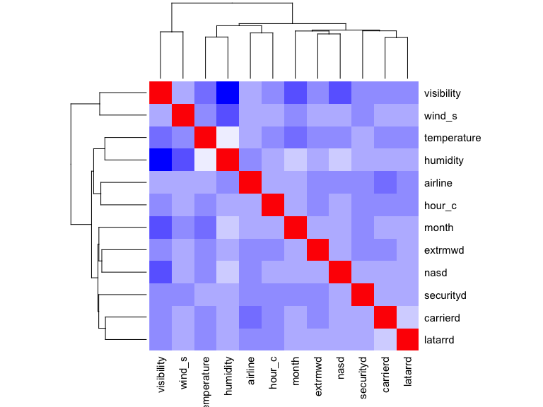

Looks good, pretty independent.

\*Could considering removing 1 of (`visibility` and `humidity`) as they
have a moderate correlation coefficient (-0.54)

## Assumption 3: Normality

Check this after we make the model.

## Assumption 4: Homoscedasticity

Check this after we make the model.

# Step 3: Building linear regression model

## Perform linear regression with all predictors

``` r
lm_all = lm(delay ~ ., data = raw_df)
summary(lm_all)
```

    ## 
    ## Call:
    ## lm(formula = delay ~ ., data = raw_df)
    ## 
    ## Residuals:
    ##    Min     1Q Median     3Q    Max 
    ## -72.31  -5.46  -1.80   2.96 466.00 
    ## 
    ## Coefficients:
    ##                           Estimate Std. Error t value Pr(>|t|)    
    ## (Intercept)               1.817474   0.693937   2.619 0.008821 ** 
    ## month1                   -0.014309   0.207595  -0.069 0.945048    
    ## month12                   0.559148   0.157783   3.544 0.000395 ***
    ## airlineDelta Air Lines   -0.853021   0.179019  -4.765 1.90e-06 ***
    ## airlineRepublic Airways  -6.817158   0.184339 -36.982  < 2e-16 ***
    ## airlineAmerican Airlines -1.775304   0.199506  -8.899  < 2e-16 ***
    ## airlineEndeavor Air      -5.330495   0.205239 -25.972  < 2e-16 ***
    ## airlineAlaska Airlines   -6.551832   0.372406 -17.593  < 2e-16 ***
    ## airlineUnited Air Lines  -3.367266   0.582855  -5.777 7.67e-09 ***
    ## carrierd                  1.046131   0.001951 536.255  < 2e-16 ***
    ## extrmwd                   1.013910   0.005062 200.309  < 2e-16 ***
    ## nasd                      0.399336   0.005482  72.842  < 2e-16 ***
    ## securityd                 1.081225   0.041482  26.065  < 2e-16 ***
    ## latarrd                   1.058872   0.003298 321.033  < 2e-16 ***
    ## temperature              -0.037177   0.008367  -4.443 8.88e-06 ***
    ## humidity                 -0.002925   0.004312  -0.678 0.497590    
    ## visibility                0.295628   0.038703   7.638 2.27e-14 ***
    ## wind_s                   -0.005066   0.010165  -0.498 0.618192    
    ## hour_cnoon               -2.034640   0.177463 -11.465  < 2e-16 ***
    ## hour_cafternoon          -0.801831   0.175172  -4.577 4.73e-06 ***
    ## hour_cmorning            -3.278425   0.179473 -18.267  < 2e-16 ***
    ## ---
    ## Signif. codes:  0 '***' 0.001 '**' 0.01 '*' 0.05 '.' 0.1 ' ' 1
    ## 
    ## Residual standard error: 10.59 on 29704 degrees of freedom
    ## Multiple R-squared:  0.9467, Adjusted R-squared:  0.9467 
    ## F-statistic: 2.639e+04 on 20 and 29704 DF,  p-value: < 2.2e-16

*Note:*

R-squared = 0.9467 -\> good

F-statistic: F-value = 2.639e+04 -\> large, variance between \>\>
variance within, good  
p-value \< 2.2e-16 -\> small, significant, good

*The F-test of overall significance indicates whether this current
linear regression model provides a better fit to the data than a model
that contains no independent variables.*

`humidity` -\> p-value = 0.497590 (not significant) under this model -\>
given what’s mentioned above, remove

`wind_s` -\> p-value = 0.618192 (not significant) under this model -\>
remove

Fit lm without `wind_s` or `humidity`

``` r
raw_df_10 = raw_df %>% 
  select(-humidity, -wind_s)

lm_10 = lm(delay ~ ., data = raw_df_10)
summary(lm_10)
```

    ## 
    ## Call:
    ## lm(formula = delay ~ ., data = raw_df_10)
    ## 
    ## Residuals:
    ##    Min     1Q Median     3Q    Max 
    ## -72.27  -5.46  -1.80   2.96 466.11 
    ## 
    ## Coefficients:
    ##                           Estimate Std. Error t value Pr(>|t|)    
    ## (Intercept)               1.547322   0.590098   2.622 0.008742 ** 
    ## month1                   -0.041123   0.204769  -0.201 0.840834    
    ## month12                   0.556387   0.157480   3.533 0.000411 ***
    ## airlineDelta Air Lines   -0.850964   0.178994  -4.754 2.00e-06 ***
    ## airlineRepublic Airways  -6.814635   0.184303 -36.975  < 2e-16 ***
    ## airlineAmerican Airlines -1.776285   0.199482  -8.904  < 2e-16 ***
    ## airlineEndeavor Air      -5.327340   0.205146 -25.969  < 2e-16 ***
    ## airlineAlaska Airlines   -6.554049   0.372371 -17.601  < 2e-16 ***
    ## airlineUnited Air Lines  -3.362436   0.582786  -5.770 8.03e-09 ***
    ## carrierd                  1.046114   0.001951 536.308  < 2e-16 ***
    ## extrmwd                   1.013883   0.005061 200.323  < 2e-16 ***
    ## nasd                      0.399011   0.005466  72.993  < 2e-16 ***
    ## securityd                 1.081295   0.041479  26.068  < 2e-16 ***
    ## latarrd                   1.058777   0.003296 321.271  < 2e-16 ***
    ## temperature              -0.038891   0.008037  -4.839 1.31e-06 ***
    ## visibility                0.307304   0.033640   9.135  < 2e-16 ***
    ## hour_cnoon               -2.014486   0.172905 -11.651  < 2e-16 ***
    ## hour_cafternoon          -0.784077   0.172651  -4.541 5.61e-06 ***
    ## hour_cmorning            -3.292524   0.178558 -18.440  < 2e-16 ***
    ## ---
    ## Signif. codes:  0 '***' 0.001 '**' 0.01 '*' 0.05 '.' 0.1 ' ' 1
    ## 
    ## Residual standard error: 10.58 on 29706 degrees of freedom
    ## Multiple R-squared:  0.9467, Adjusted R-squared:  0.9467 
    ## F-statistic: 2.932e+04 on 18 and 29706 DF,  p-value: < 2.2e-16

*Note:*

R-squared = 0.9467 -\> same, good

F-statistic: F-value = 2.932e+04 -\> close, large, variance between \>\>
variance within, good p-value \< 2.2e-16 -\> same, small, significant,
good

## Fit the best subset linear model

The function regsubsets() will produce the best model with 1 predictor,
the best model with 2 predictors, 3 predictors, … up to 14
predictors(nvmax=14 option).

``` r
library(leaps)

bestsub.lm <- regsubsets(delay ~ ., 
                            data = raw_df_10, nvmax = 18)

sum.bestsub.lm = summary(bestsub.lm)
```

We have 18 predictor parameters, and the sample size 29725 will be
sufficient for it (“One in ten” rule)

Check some measures to select the best subset model

*Note:*

A small value of Cp means that the model is relatively precise.

A larger R-squared value means that the independent variables explain a
larger percentage of the variation in the independent variable.

A lower BIC implies either fewer explanatory variables, better fit, or
both.

``` r
cbind( 
    Cp = summary(bestsub.lm)$cp,
    r2 = summary(bestsub.lm)$rsq,
    BIC = summary(bestsub.lm)$bic
)
```

    ##                 Cp        r2       BIC
    ##  [1,] 162974.57340 0.6543593 -31557.92
    ##  [2,]  50807.45804 0.8555586 -57483.45
    ##  [3,]   8320.51509 0.9317716 -79767.28
    ##  [4,]   3112.94055 0.9411161 -84135.26
    ##  [5,]   2161.15122 0.9428269 -85001.40
    ##  [6,]   1443.34944 0.9441180 -85670.06
    ##  [7,]    974.92935 0.9449618 -86112.02
    ##  [8,]    704.72935 0.9454501 -86366.59
    ##  [9,]    426.64945 0.9459524 -86631.31
    ## [10,]    292.63274 0.9461964 -86755.50
    ## [11,]    195.17830 0.9463748 -86843.92
    ## [12,]    138.09244 0.9464808 -86892.43
    ## [13,]    101.27835 0.9465504 -86920.82
    ## [14,]     75.07943 0.9466010 -86938.66
    ## [15,]     52.67099 0.9466448 -86952.74
    ## [16,]     33.22710 0.9466832 -86963.88
    ## [17,]     17.04033 0.9467159 -86971.77
    ## [18,]     19.00000 0.9467159 -86961.52

``` r
which.max(sum.bestsub.lm$rsq)
```

    ## [1] 18

``` r
sum.bestsub.lm$which[18,]
```

    ##              (Intercept)                   month1                  month12 
    ##                     TRUE                     TRUE                     TRUE 
    ##   airlineDelta Air Lines  airlineRepublic Airways airlineAmerican Airlines 
    ##                     TRUE                     TRUE                     TRUE 
    ##      airlineEndeavor Air   airlineAlaska Airlines  airlineUnited Air Lines 
    ##                     TRUE                     TRUE                     TRUE 
    ##                 carrierd                  extrmwd                     nasd 
    ##                     TRUE                     TRUE                     TRUE 
    ##                securityd                  latarrd              temperature 
    ##                     TRUE                     TRUE                     TRUE 
    ##               visibility               hour_cnoon          hour_cafternoon 
    ##                     TRUE                     TRUE                     TRUE 
    ##            hour_cmorning 
    ##                     TRUE

All true -\> keep all

## Fit the regression model

``` r
Best_lm = lm(delay ~  .,
              data = raw_df_10)
summary(Best_lm) %>% broom::glance()
```

    ## # A tibble: 1 × 8
    ##   r.squared adj.r.squared sigma statistic p.value    df df.residual  nobs
    ##       <dbl>         <dbl> <dbl>     <dbl>   <dbl> <dbl>       <int> <dbl>
    ## 1     0.947         0.947  10.6    29322.       0    18       29706 29725

``` r
summary(Best_lm) %>% 
  broom::tidy() %>% 
  select(term, estimate, p.value)
```

    ## # A tibble: 19 × 3
    ##    term                     estimate   p.value
    ##    <chr>                       <dbl>     <dbl>
    ##  1 (Intercept)                1.55   8.74e-  3
    ##  2 month1                    -0.0411 8.41e-  1
    ##  3 month12                    0.556  4.11e-  4
    ##  4 airlineDelta Air Lines    -0.851  2.00e-  6
    ##  5 airlineRepublic Airways   -6.81   1.25e-292
    ##  6 airlineAmerican Airlines  -1.78   5.66e- 19
    ##  7 airlineEndeavor Air       -5.33   4.93e-147
    ##  8 airlineAlaska Airlines    -6.55   5.44e- 69
    ##  9 airlineUnited Air Lines   -3.36   8.03e-  9
    ## 10 carrierd                   1.05   0        
    ## 11 extrmwd                    1.01   0        
    ## 12 nasd                       0.399  0        
    ## 13 securityd                  1.08   3.89e-148
    ## 14 latarrd                    1.06   0        
    ## 15 temperature               -0.0389 1.31e-  6
    ## 16 visibility                 0.307  6.95e- 20
    ## 17 hour_cnoon                -2.01   2.66e- 31
    ## 18 hour_cafternoon           -0.784  5.61e-  6
    ## 19 hour_cmorning             -3.29   1.67e- 75

## Check for residual normality

``` r
library("olsrr")
```

    ## 
    ## Attaching package: 'olsrr'

    ## The following object is masked from 'package:datasets':
    ## 
    ##     rivers

``` r
ols_plot_resid_fit(Best_lm)
```

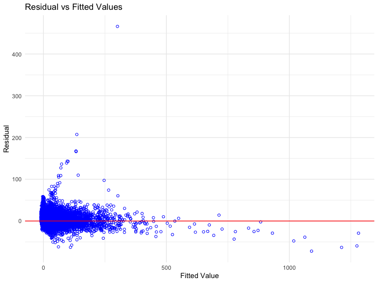

``` r
# residual vs fitted
plot(Best_lm, 1)
```

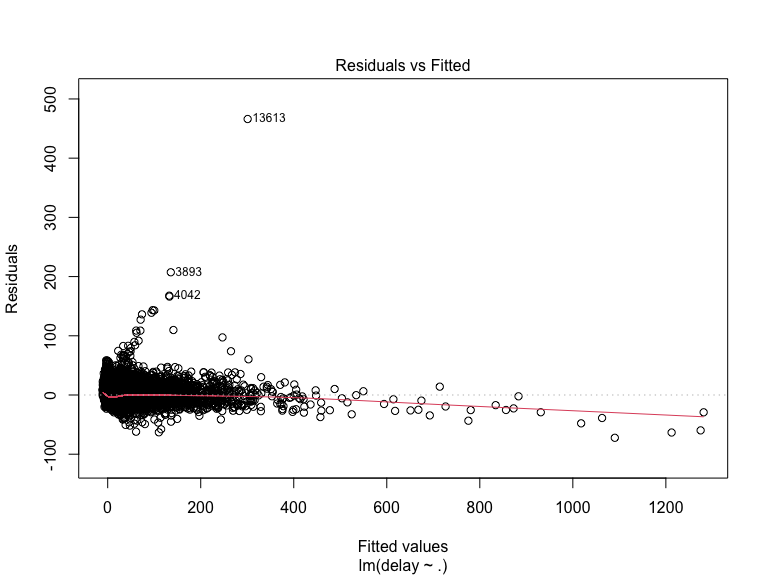

``` r
#qq plot
plot(Best_lm, 2)
```

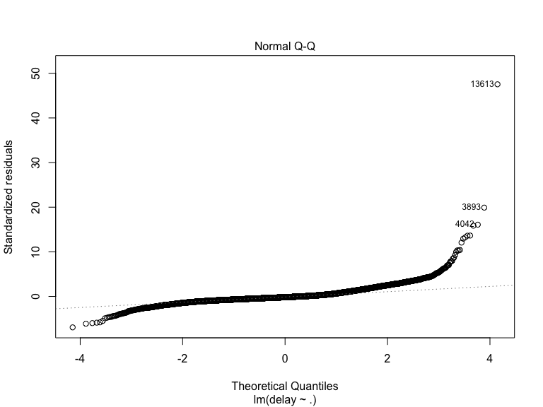

## Check for heteroscadacity

``` r
plot(Best_lm, 3)
```

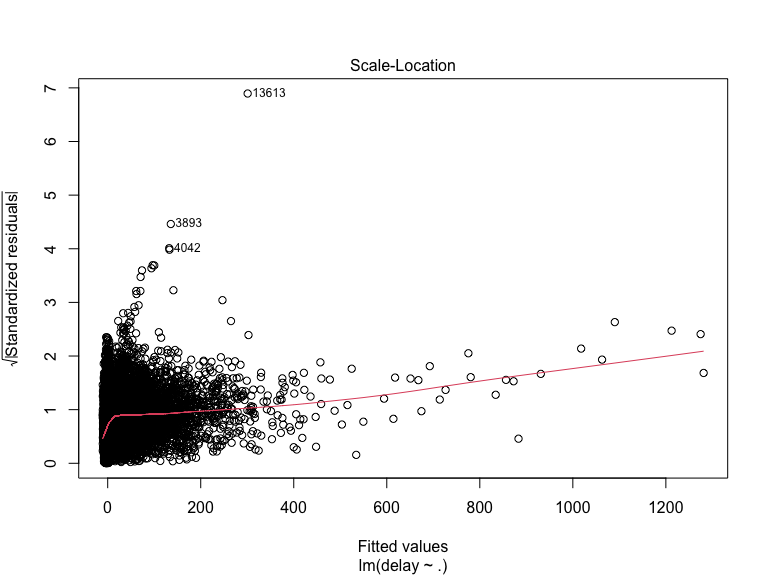
