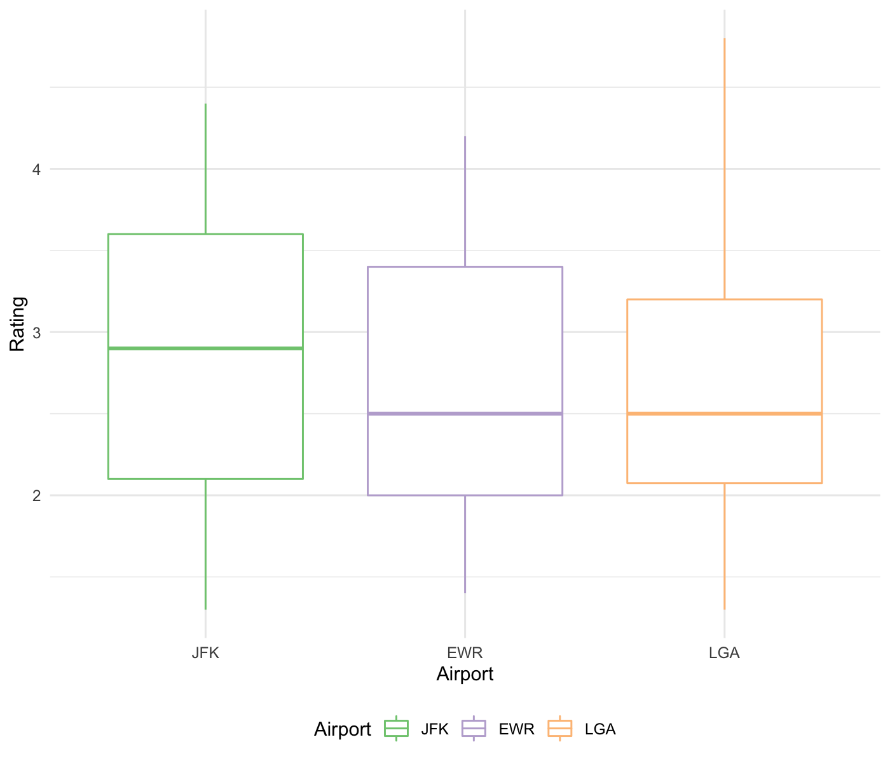
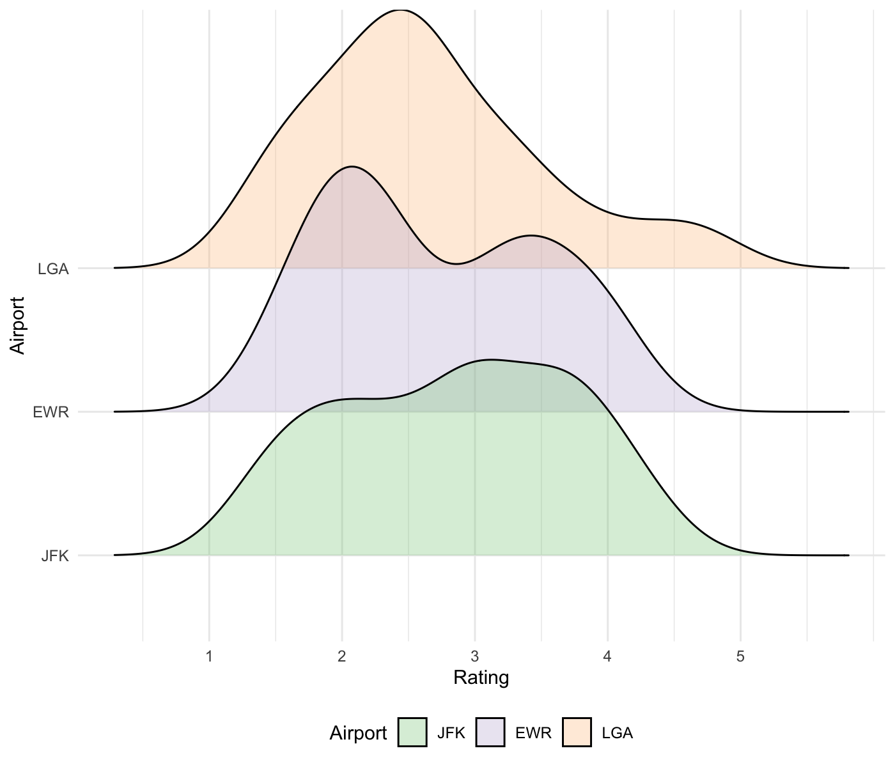

Scraping Data (Restaurants)
================

First, write a scraping function.

``` r
scrape_rating = function(url){

  air_html = read_html(url)
  
  air_rest_vec = 
    air_html %>% 
    html_nodes(css = ".company-link") %>% 
    html_text()

  air_rest_rate_vec = 
    air_html %>% 
    html_nodes(css = ".ratings") %>% 
    html_text()
  
  air_df = 
    tibble(
      rest_name = air_rest_vec,
      rating = air_rest_rate_vec
    ) %>% 
    mutate(
      rating = as.numeric(str_extract(rating, "\\d+\\.*\\d*"))
    )
    
  air_df
  
}
```

## Restaurants

Official website of [JFK International
Airport](https://www.jfkairport.com/at-airport/shops-restaurants-and-services).

[Unofficial website](https://jfkfly.com/dining-drinking).

Information obtained from [unofficial website for
JKF](https://www.airport-jfk.com/restaurants-and-food.php). <br>
Information obtained from [unofficial website for
LGA](https://www.laguardia-airport.com/restaurants-and-food.php). <br>
Information obtained from [unofficial website for
EWR](https://www.airport-ewr.com/newark-restaurants-and-food.php).

``` r
jfk_url = "https://www.airport-jfk.com/restaurants-and-food.php"
lga_url = "https://www.laguardia-airport.com/restaurants-and-food.php"
ewr_url = "https://www.airport-ewr.com/newark-restaurants-and-food.php"

jfk_df = scrape_rating(jfk_url) %>% 
  mutate(airport = "JFK")

lga_df = scrape_rating(lga_url) %>% 
  mutate(airport = "LGA")

ewr_df = scrape_rating(ewr_url) %>% 
  mutate(airport = "EWR")
```

Merge the restaurant dataframe.

``` r
rest_df = bind_rows(jfk_df, lga_df, ewr_df) %>% 
  mutate(
    airport = fct_reorder(airport, rating, na.rm = TRUE, .desc = TRUE),
    category = "Restaurants"
  )
```

Make some preliminary visualization on restaurant ratings for the three
airports.

``` r
rest_df %>% 
  ggplot(aes(x = airport, y = rating, color = airport)) +
  geom_boxplot() +
  scale_color_brewer(palette = "Accent") +
  labs(
    x = "Airport",
    y = "Rating",
    color = "Airport"
  )
```



``` r
rest_df %>%
  ggplot(aes(x = rating, y = airport, fill = airport)) +
  geom_density_ridges(alpha = .3) +
  scale_x_continuous(
    breaks = 1:5
  ) +
  scale_fill_brewer(palette = "Accent") +
  labs(
    x = "Rating",
    y = "Airport",
    fill = "Airport"
  )
```



## Shops and Stores

[JFK](https://www.airport-jfk.com/shops-and-stores.php). <br>
[LGA](https://www.laguardia-airport.com/shops-and-stores.php). <br>
[EWR](https://www.airport-ewr.com/newark-shops-and-stores.php).

``` r
jfk_url = "https://www.airport-jfk.com/shops-and-stores.php"
lga_url = "https://www.laguardia-airport.com/shops-and-stores.php"
ewr_url = "https://www.airport-ewr.com/newark-shops-and-stores.php"
```

``` r
jfk_df = scrape_rating(jfk_url) %>% 
  mutate(airport = "JFK")

lga_df = scrape_rating(lga_url) %>% 
  mutate(airport = "LGA")

ewr_df = scrape_rating(ewr_url) %>% 
  mutate(airport = "EWR")
```

Merge the shops & stores dataframe.

``` r
shop_df = bind_rows(jfk_df, lga_df, ewr_df) %>% 
  mutate(
    airport = fct_reorder(airport, rating, na.rm = TRUE, .desc = TRUE),
    category = "Shops"
  ) 
```

## Lounges

[JFK](https://www.airport-jfk.com/services.php). <br>
[LGA](https://www.laguardia-airport.com/services.php). <br>
[EWR](https://www.airport-ewr.com/newark-lounge-night-club.php).

## Other Services
