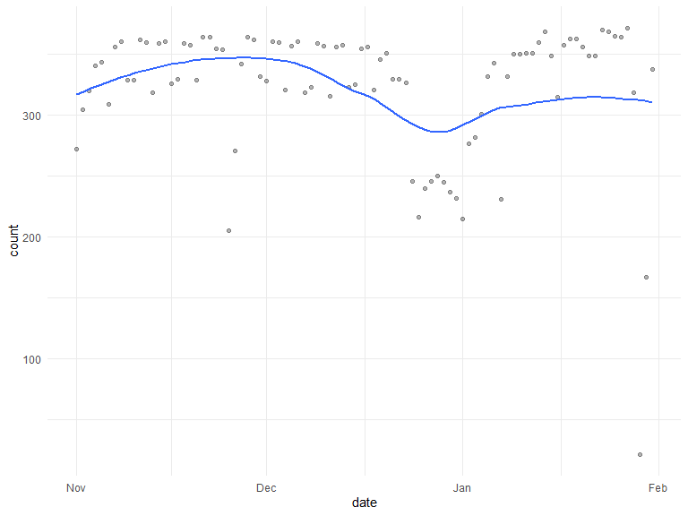
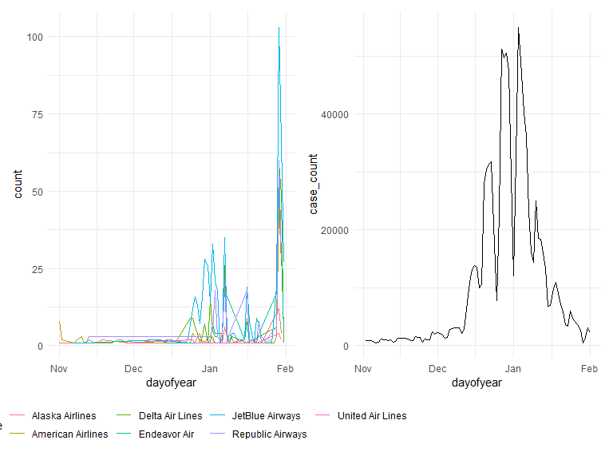

Visualization and EDA
================

``` r
delay %>% 
  mutate(
    date = as.numeric(date),
    month = as.numeric(month),
    month_date = str_c(year, month, date, sep = "-"),
    dayofyear = as.Date(month_date)
  ) %>% 
  group_by(dayofyear, airline_name) %>% 
  summarize(
    count = n()
  ) %>% 
  ggplot(aes(x = dayofyear, y = count, color = airline_name)) +
  geom_line()
```

    ## `summarise()` has grouped output by 'dayofyear'. You can override using the
    ## `.groups` argument.



``` r
cancel_line = cancelation %>% 
    mutate(
    date = as.numeric(date),
    month = as.numeric(month),
    month_date = str_c(year, month, date, sep = "-"),
    dayofyear = as.Date(month_date)
  ) %>% 
  group_by(dayofyear, airline_name) %>% 
  summarize(
    count = n()
  ) %>% 
  ggplot(aes(x = dayofyear, y = count, color = airline_name)) +
  geom_line()
```

    ## `summarise()` has grouped output by 'dayofyear'. You can override using the
    ## `.groups` argument.

``` r
covid_line = covid %>% 
  mutate(
    day = as.numeric(day),
    month = as.numeric(month),
    month_date = str_c(year, month, day, sep = "-"),
    dayofyear = as.Date(month_date)
  ) %>% 
  ggplot(aes(x = dayofyear, y = case_count)) +
  geom_line()

cancel_line + covid_line
```


