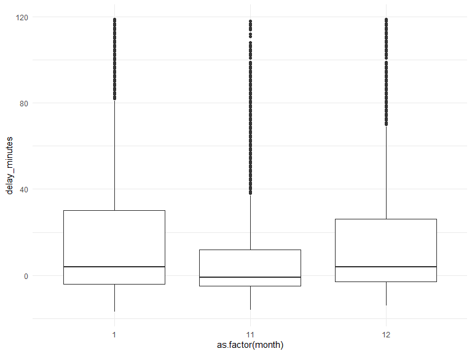
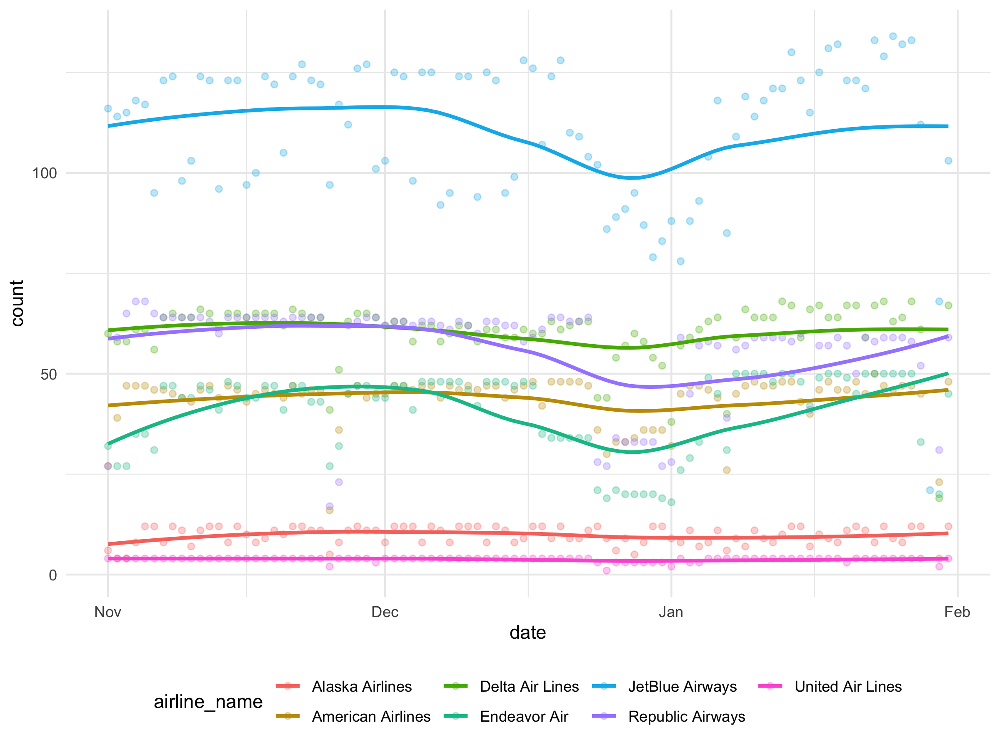
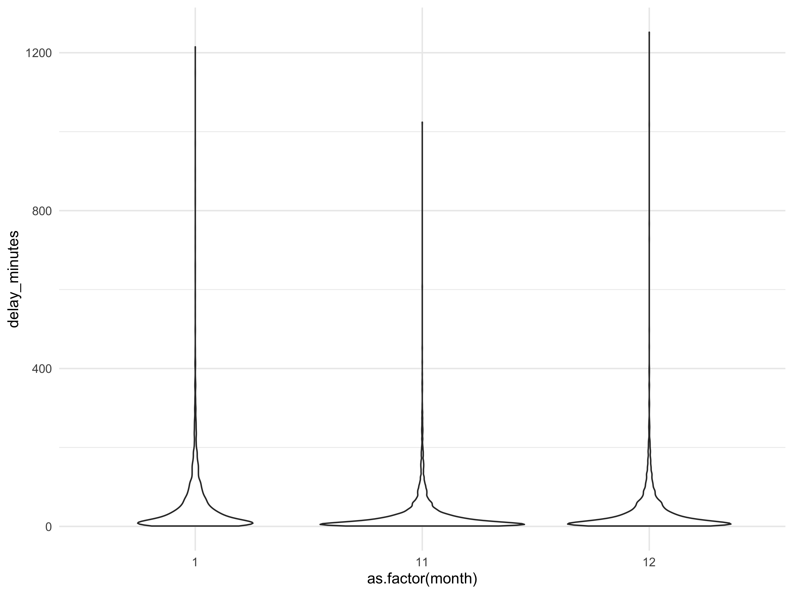
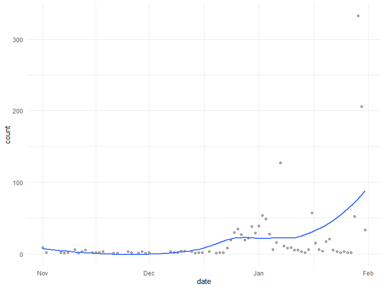
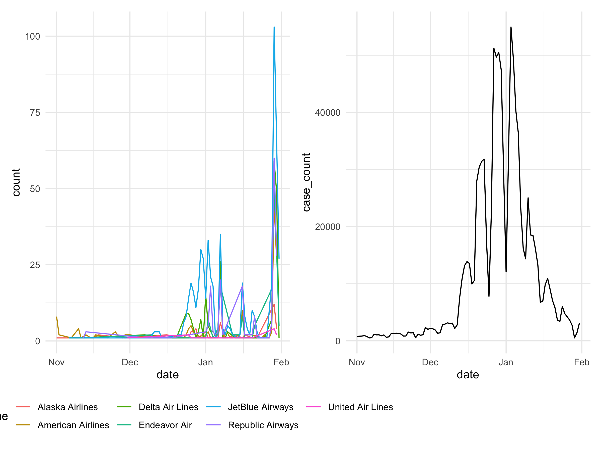

Visualization and EDA
================

``` r
delay %>% 
  group_by(date) %>% 
  summarize(
    count = n()
  ) %>% 
  ggplot(aes(x = date, y = count)) +
  geom_point(alpha = .3) +
  geom_smooth(se = FALSE)
```


``` r
delay %>% 
  group_by(month) %>% 
  summarize(
    count = n()
  ) %>% 
  ggplot(aes(x = count, y = as.factor(month), fill = month)) +
  geom_density_ridges(alpha = .5)
```



``` r
delay %>% 
  group_by(date, airline_name) %>% 
  summarize(
    count = n()
  ) %>% 
  ggplot(aes(x = date, y = count, color = airline_name)) +
  geom_point(alpha = .3) +
  geom_smooth(se = FALSE)
```



``` r
delay %>% 
  group_by(month) %>% 
  filter(delay_minutes > 0) %>% 
  ggplot(aes(x = as.factor(month), y = delay_minutes)) +
  geom_violin()
```



``` r
cancel %>% 
  group_by(date) %>% 
  summarize(
    count = n()
  ) %>% 
  ggplot(aes(x = date, y = count)) +
  geom_point(alpha = .3) +
  geom_smooth(se = FALSE)
```



``` r
# Make a ggplot, but add frame=year: one image per year

delay %>% 
  group_by(month) %>% 
  mutate(
    count = n()
  ) %>% 
  ungroup(month) %>% 
ggplot(aes(x = date, y = delay_minutes, size = count, color = airline_name)) +
  geom_point(alpha = 0.7, show.legend = FALSE) +
  #scale_colour_manual(values = airline_name) +
  scale_size(range = c(2, 12)) +
  facet_wrap(.~airline_name) +
  # Here comes the gganimate specific bits
  labs(title = 'Month: {frame_time}', x = 'date', y = 'delay_minutes') +
  transition_time(month) +
  ease_aes('linear')

# Save at gif:
anim_save("271-ggplot2-animated-gif-chart-with-gganimate2.gif")
```

``` r
cancel_line = cancel %>% 
  group_by(date, airline_name) %>% 
  summarize(
    count = n()
  ) %>% 
  ggplot(aes(x = date, y = count, color = airline_name)) +
  geom_line()


covid_line = covid %>% 
  ggplot(aes(x = date, y = case_count)) +
  geom_line()

cancel_line + covid_line
```


