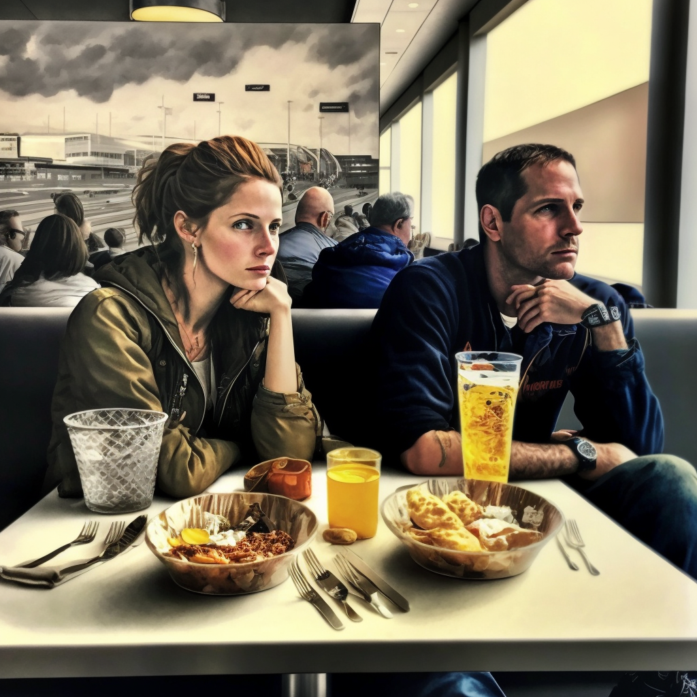
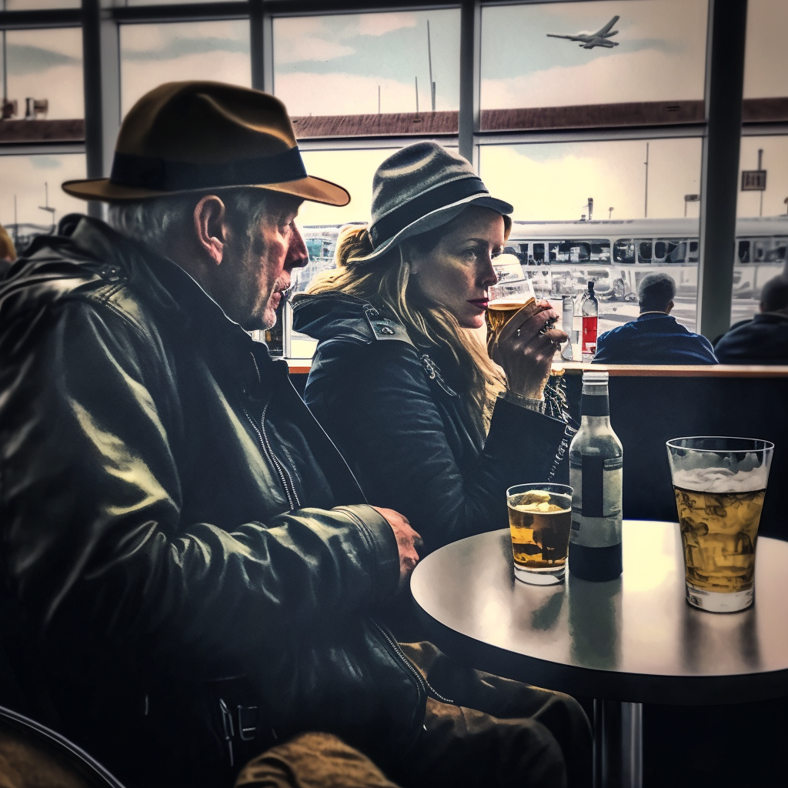
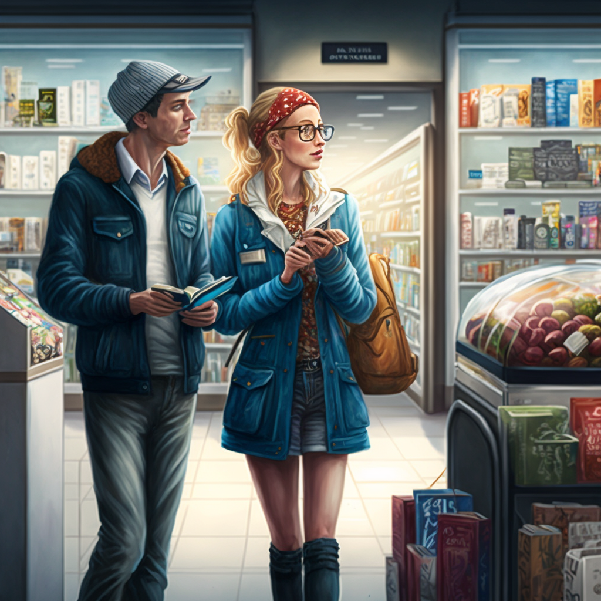
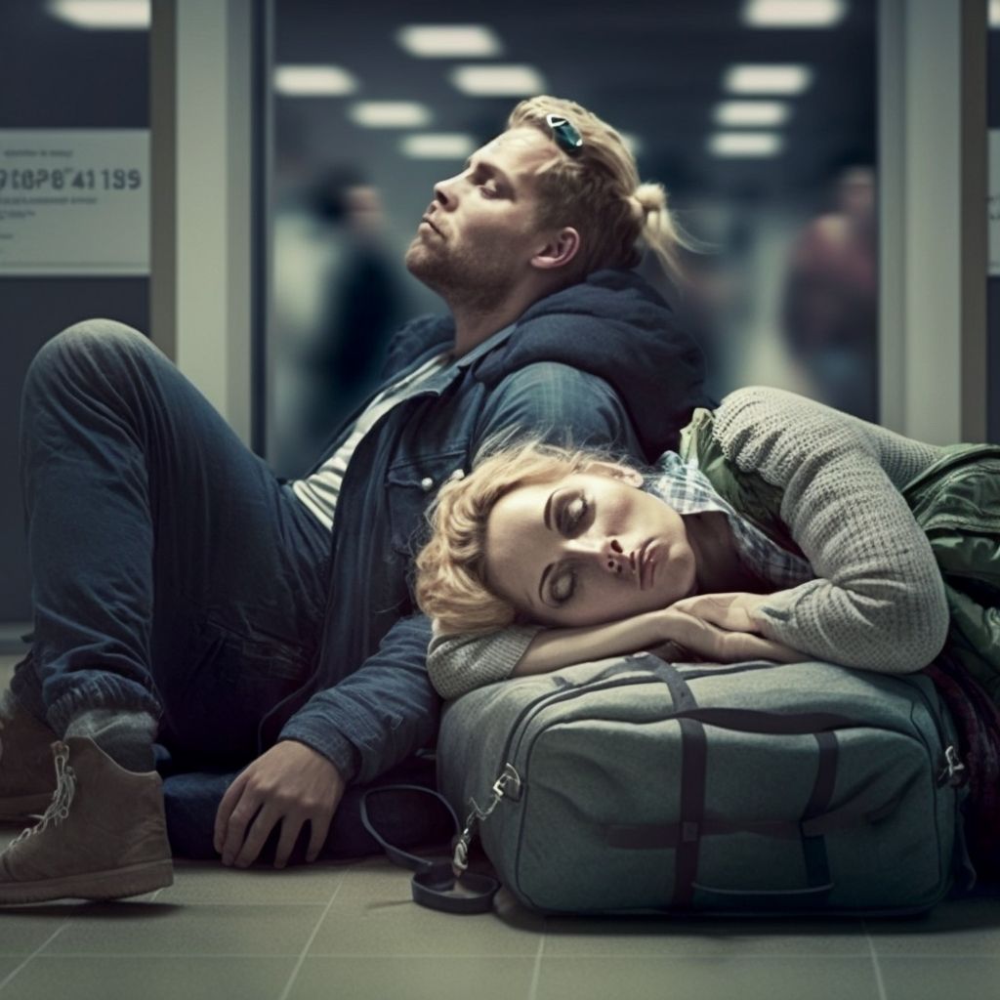

```{r setup, include = FALSE}
knitr::opts_chunk$set(
  echo = TRUE,
  message = FALSE,
  warning = FALSE)
```

&nbsp;

Here are 10 things to do on a layover at JFK Airport.

# 1. Eat

Airport DiningJFK offers some excellent dining options for all budgets. The Shake Shack has a location in Terminal 4 that offers all the favorites of its outside-the-airport locations including breakfast sandwiches and excellent coffee. Meat lovers will appreciate Terminal 4’s Blue Smoke on the Road, which serves ribs, sausages and sandwiches.

Famous New York chef Andrew Carmellini opened the Croque Madame in Terminal 2. Diners have raved about the sandwich shop’s open faced sandwiches, crepes, and made to order salads.

For those looking for a lighter snack, Deep Blue Sushi in Terminal 5 is known for serving “the best sushi you will probably ever eat in an airport.” Customers often come early before their flights just to try out the restaurant’s fresh selection. Deep Blue Sushi also offers grab and go meals.

```{r, echo = FALSE, out.width = "50%", fig.cap = "(Generated via [Midjourney](https://midjourney.com/))", fig.align = 'center'}

```

# 2. Drink

While the aforementioned Shake Shack is known for swinging the occasional craft beer along with a variety of other alcoholic beverages, the BRKLYN Beer Garden in Terminal 2 is another great option for any passengers looking to relax before a long flight. Customers are split on the merits of the Beer Garden’s iPad ordering system, though many find its doubling as an internet connection and game station to be an enjoyable amenity. A word to the wise regarding this spot: while the beer selection is great, passengers may be advised to eat elsewhere.

For those with more refined tastes, Vino Volo Wine Shop has a location in Terminal 8 that has been highly appreciated by passengers for its excellent wine, great food selection, plentiful charging stations and free Wi-Fi.

```{r, echo = FALSE, out.width = "50%", fig.cap = "(Generated via [Midjourney](https://midjourney.com/))", fig.align = 'center'}

```

# 3. Check out an Airport Lounge

Turn a long, boring layover into a day of rest and relaxation. While many airport lounges cater only to First and Business Class travellers, many lounges at JFK welcome any traveller willing to pay – which means even us Economy Class travellers can enjoy a quieter, upgraded few hours. Several lounges include food and drink in the entry price and some even have shower facilities for freshening up. See this [JFK Airport Guide](https://www.sleepinginairports.net/guides/new-york-city-jfk-airport-guide.htm#lounges) for more information about the airport’s lounges.

```{r, echo = FALSE, out.width = "50%", fig.cap = "(Generated via [Midjourney](https://midjourney.com/))", fig.align = 'center'}
knitr::include_graphics("./pictures/lounge.png")
```

# 4. Shop

JFK offers a variety of options for the shopping passenger. There are a several shops selling brand-name apparel like Juicy Couture and Coach in Terminal 1, while techies can find the gadgets they need at the Best Buy in Terminal 2. Terminal 4 has a Duty Free location as well as a Guess, MAC, and Victoria’s Secret, and passengers can catch up with their reading in the New York Times Books located in Terminal 5. Regardless of the terminal, travelers can find a variety of flower shops, souvenir shops, and news stands throughout the airport, along with Xpress Spas for those in need of a little pampering.

```{r, echo = FALSE, out.width = "50%", fig.cap = "(Generated via [Midjourney](https://midjourney.com/))", fig.align = 'center'}

```

# 5. Surf the Web

Stay connected to friends and family, update your social media accounts or surf the internet courtesy of the airport’s free and unlimited WiFi.

```{r, echo = FALSE, out.width = "50%", fig.cap = "(Generated via [Midjourney](https://midjourney.com/))", fig.align = 'center'}

```

# 6. Play

Parents will be happy to hear that there’s an enclosed children’s play area in Terminal 5 equipped with some toddler activity toys. The spot doesn’t look like much, but the interactive playthings provided are substantially bright and button-filled to offer up a short-term distraction for kids and a well-deserved break for parents.

```{r, echo = FALSE, out.width = "50%", fig.cap = "(Generated via [Midjourney](https://midjourney.com/))", fig.align = 'center'}
knitr::include_graphics("./pictures/kids.png")
```

# 7. Pamper Yourself between Flights

Freshen up with a facial, a mani/pedi, or massage treatment at XpresSpa. There are several main locations: Terminal 1 airside near Gate 3 and 6, Terminal 4 at Gate A2, Gate B24, and the airside Retail Hall West, and Terminal 7 airside in the Retail Hall.

```{r, echo = FALSE, out.width = "50%", fig.cap = "(Generated via [Midjourney](https://midjourney.com/))", fig.align = 'center'}
knitr::include_graphics("./pictures/spa.png")
```

# 8. Pray

No matter your religious affiliation, an interfaith chapel located landside in Terminal 4 offers peace and solace.

```{r, echo = FALSE, out.width = "50%", fig.cap = "(Generated via [Midjourney](https://midjourney.com/))", fig.align = 'center'}
knitr::include_graphics("./pictures/pray2.png")
```

# 9. Head into NYC

If you’ve got a long layover here, you’re doing yourself a disservice if you don’t get out and see what the Big Apple is all about. We don’t recommend leaving the airport unless you’ve got at least 6 hours, but if you do have that time, exploring the city will be worth it!

First up – leaving the airport. The AirTrain connects all terminals with Jamaica Station, so you can hop on the E, J, and Z trains into Manhattan. An express bus called NYCAirporter also connects directly to Penn Station and Grand Central Station in Midtown. For direct service, head to the taxi stands outside all terminals – but don’t be surprised by bad traffic. (Note that you can check your baggage during the day most terminals.)

New York City is huge, so you’re best bet is to pick 1 or 2 sights of interest and add those in. We love a visit to Central Park for fresh air – the perfect way to kick jet lag. Or head into one of the best art collections in the world at museums like MoMA, Met, Whitney, Guggenheim, and many more. If you’d rather take in the look and feel of the city, hop-on-hop-off buses and boats that circle all or part of Manhattan are great options. For more ideas, take a look at this [New York City JFK Layover Sightseeing Guide](https://www.sleepinginairports.net/sightseeing/jfk-airport-layover-sightseeing.htm).

Wherever you’re exploring, definitely leave plenty of time to make it back to the airport. Taxis can mean navigating lots of traffic, and security lines can get pretty long at JFK.

```{r, echo = FALSE, out.width = "50%", fig.cap = "(Generated via [Midjourney](https://midjourney.com/))", fig.align = 'center'}
knitr::include_graphics("./pictures/sightseeing.png")
```

# 10. Sleep

You certainly won’t be the only person trying to catch up on sleep here, but it won’t be a very comfortable experience. The seating is fairly limited for the number of travellers coming and going, and it’s mostly metal benches with armrests. Grab some space on the floor – and maybe bring a sleeping mat along with extra layers and earplugs to fight the chilly and noisy atmosphere. If you’re in Terminal 5, you may get lucky with a quick daytime nap in the two sleep pods – but you better hurry, they are limited to 20 minutes per person. If you’d rather sleep in an actual bed and get some privacy, you’ll have to shell out for a hotel. The only onsite hotel is located at Terminal 5 and there are many more within a few minutes’ drive of the airport, and most provide free airport shuttle service. See this [New York City JFK Airport Guide](https://www.sleepinginairports.net/guides/new-york-city-jfk-airport-guide.htm#hotels) for details.

```{r, echo = FALSE, out.width = "50%", fig.cap = "(Generated via [Midjourney](https://midjourney.com/))", fig.align = 'center'}

```

